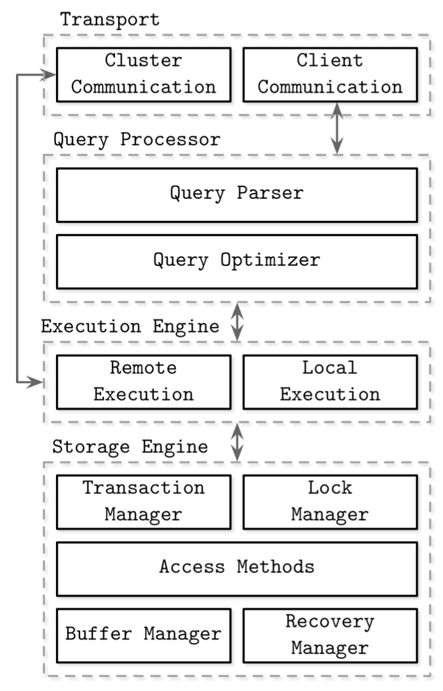
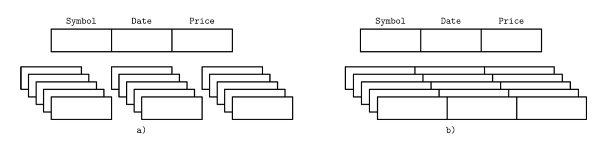
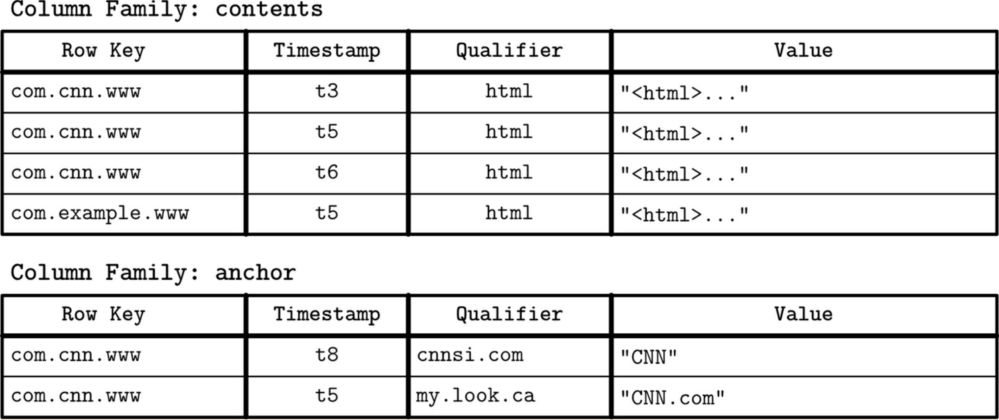
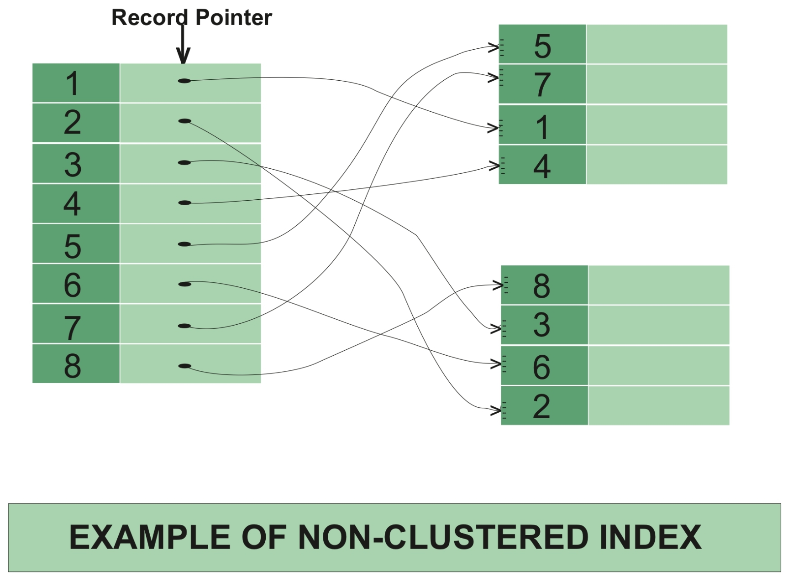
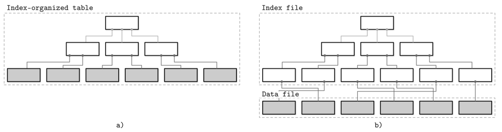
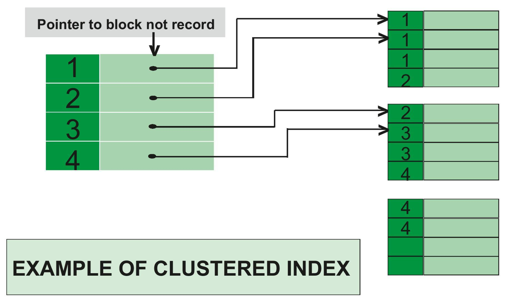
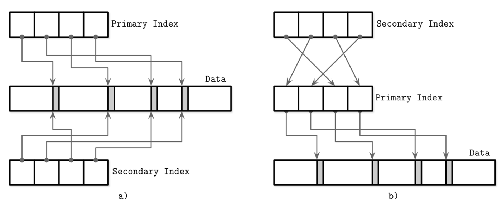

# [01] 소개 및 개요

## DBMS 구조

---

- 표준화된 DBMS 구조란 존재하지 않는다!
    - 모든 데이터베이스 구조는 서로 다르고, 내부 컴포넌트의 경계를 명확하게 나누거나 정의하는 것이 어렵다
    - 따라서, DBMS 구조에 대한 설명들을 보면 컴포넌트와 컴포넌트 간의 관계에 대한 정의가 다르다
- 공통된 정의는 다음과 같다
    
    
    
    - 트랜스포트
        - 클라이언트의 요청은 ‘트랜스포트 서브시스템’을 통해 전달된다
        - 요청은 쿼리 형태이다
        - 트랜스포트 서브시스템은 데이터베이스 클러스터 노드 사이의 통신에도 사용된다
    - 쿼리 프로세서
        - 쿼리 파서
            - 트랜스포트 서브시스템은 쿼리를 ‘쿼리 프로세서’에게 전달한다
            - 쿼리 프로세서는 쿼리를 해석하고 분석한다
            - 쿼리의 의미를 파악한 뒤에 액세스 제어를 진행한다
        - 쿼리 옵티마이저
            - 쿼리 프로세서에게 분석된 쿼리는 ‘옵티마이저’에게 전달된다
            - 쿼리에서 논리적으로 불가능한 부분과 중복을 제거하여, 내부 데이터 통계(인덱스 카디널리티와 교집합 크기 등)와 데이터 위치(클러스터 내 데이터 저장 위치와 전송 비용)등을 기반으로 가장 효율적인 쿼리 실행 계획을 생성한다
            - 옵티마이저가 하는 일 : 최적화 단계를 처리한다
                - 쿼리 수행에 필요한 관계형 연산을 종속 트리로 변환
                - 최적화
                    - 인덱스 순서 선택
                    - 카디널리티 예측
                    - 액세스 메소드 선택
            - 쿼리는 일반적으로 실행계획 형태로 표현한다
                - 실행계획? 쿼리가 결과를 도출하는 데에 수행해야 할 일련의 작업
                - 같은 쿼리라도, 여러 실행 계획이 존재할 수 있다
                - 옵티마이저가 이 여러 실행계획 중에 가장 효율적인 실행 계획을 선택한다
    - 실행 엔진
        - 실행 엔진이 선택된 실행 계획을 로컬 또는 원격으로 실행한다
        - 원격 실행? 클러스터 내 여러 노드 사이에서 데이터 읽기/쓰기/복제를 수행한다
    - 스토리지엔진
        - 로컬 쿼리는 스토리지 엔진이 수행한다
        - 스토리지 엔진은 아래 컴포넌트로 구성된다
            - 트랜잭션 매니저
                - 트랜잭션을 스케줄링하고, 데이터베이스 상태의 논리적 일관성을 보장한다
            - 잠금 매니저
                - 트랜잭션에서 접근하는 데이터베이스 객체에 대한 잠금을 제어한다
                - 동시 수행 작업이 물리적 데이터 무결성을 침해하지 않도록 제어한다
            - 액세스 메소드
                - 디스크에 저장된 데이터에 대한 접근 및 저장 방식을 정의한다
                - 힙 파일과 B-트리 또는 LSM 트리 등의 자료구조를 사용한다
            - 버퍼 매니저
                - 데이터 페이지를 메모리에 캐시한다
            - 복구 매니저
                - 로그를 유지 관리하고 장애 발생 시 시스템을 복구한다
            - 트랜잭션 매니저와 잠금매니저는, 동시성을 제어하며 논리적 및 물리적 데이터 무결성을 보장한다

## 인메모리 DBMS vs 디스크 기반 DBMS

---

- 인메모리 DBMS vs 디스크 기반 DBMS
    - 인메모리 DBMS : 메모리에 데이터를 저장하고 디스크는 복구와 로그 저장 용도로 사용한다
    - 디스크 기반 DBMS : 대부분의 데이터를 디스크에 저장하고, 메모리는 캐시 또는 임시 저장 용도로 사용한다
- 두 형식 모두 메모리와 디스크 모두를 사용하지만, 인메모리 DBMS는 대부분의 데이터를 RAM에 저장한다
- 메모리를 주 저장매체로 사용하는 이유?
    1. 성능
    2. 상대적으로 낮은 데이터 접근 비용
    3. 세밀한 접근 단위
    4. 디스크 제어보다 더 간단한 제어 (프로그래밍적으로)
        - 메모리 제어 : OS의 메모리 추상화를 통해서, 개발자는 임의의 메모리 청크를 할당하고 해제하는 작업 정도로 메모리를 간단하게 제어할 수 있다
        - 디스크 제어 : 데이터 참조와 직렬화 포맷 설정, 메모리 해제, 메모리 단편화 등의 이슈를 모두 직접 관리해야 한다
- 인메모리 데이터베이스의 가장 큰 단점
    - 휘발성
        - RAM에 저장된 데이터는 영구적이지 않다
        - 소프트웨어/하드웨어 오류, 장애로 인해 데이터가 손실될 수 있다
    - 높은 가격
        - 디스크에 비해 월등히 가격이 높다
- 요약 : 메모리를 기본 스토리지로 사용하는 것이 효율적이나, 휘발성이며 가격이 비싸다
- NVM
    - Non Volatile Memory
    - 비휘발성 램
    - NVM 기술이 더 대중화되면, 상황이 뒤바뀔 수 있다
    - NVM 스토리지는 구현 방식에 따라 읽기와 쓰기 레이턴시의 불균형이 완전히 해소되거나 줄어든다
    - 읽기와 쓰기 성능이 높고 바이트 주소로 메모리에 바로 접근할 수 있다
- 인메모리 데이터베이스의 지속성
    - 인메모리 DBMS는, 데이터의 지속성을 보장하고 데이터 손실을 방지하기 위해 데이터를 디스크에 백업한다
        - (데이터의 지속성을 보장하지 않는 DBMS도 있으나, 여기에서는 다루지 않는다)
    - 인메모리 시스템에서는 백업본을 디스크 기반 자료 구조에 순서대로 저장한다
        - **백업본**을 **저장**하여, 시스템 시작과 복구 시 모든 로그를 재수행하지 않음
        - 일반적으로 수정 내용은 **비동기적으로 갱신**하며, I/O 작업을 최소화하기 위해 배치 단위로 백업한다
            - 로그 레코드는 일반적으로 배치 단위로 백업한다
                - 배치 작업이 완료되면 백업본은 특정 시점의 데이터베이스의 스냅숏
                - 이 작업을 ‘체크포인트’라고 표현한다
        - 데이터 복구 시 백업본과 로그를 기반으로 데이터를 재구성한다
            - (클라이언트의 요청을 블로킹하지 않고) 디스크에 저장된 백업본을 최신 로그 데이터와 동기화하면, 복구 시간을 단축할 수 있다

## 컬럼형 DBMS vs 로우형 DBMS

---

- 데이터를 디스크에 저장하는 방식에 따라 데이터베이스를 분류할 수 있다
    - 컬럼 저장 방식
        - 테이블을 수직분할한다
        - 같은 컬럼에 속하는 값들을 함께 저장한다
        - 컬럼형 DBMS 대표 : MonetDB, C-Store
    - 로우 저장 방식
        - 테이블을 수평분할한다
        - 같은 로우에 속하는 값들을 함께 저장한다
        - 로우형 DBMS 대표 : MySQL, PostgreSQL
    
    
    
- 로우형 데이터 레이아웃
    - 로우형 DBMS는 데이터 레코드를 로우 형식으로 저장한다
    - 로우형 DBMS는 한개의 로우씩 접근하는 경우 적합하다
        - 예시 : 특정 사용자의 정보를 조회하는 경우
    - 공간 지역성의 극대화
        - 로우 단위로 저장하면 공간 지역성을 극대화할 수 있다
        - 디스크와 같은 반영구적 저장 매체에 저장된 데이터는 블록 단위로 접근한다
        - 따라서, 한 블록에 모든 컬럼의 값을 저장한다
    - 따라서 특정 로우의 모든 정보를 읽을 때는 효율적이지만, 여러 사용자의 특정 필드를 읽을 때는 비효율적이다
- 컬럼형 데이터 레이아웃
    - 컬럼형 DBMS는 데이터를 로우 단위가 아니라 수직 분할하여 컬럼 단위로 저장한다
        - 같은 컬럼끼리 디스크에 연속해 저장하는 방식이다
    - 컬럼형 DBMS는 데이터의 추세와 평균 등을 계산하는 집계 분석 작업에 적합하다
        - 복잡한 집계 작업에서는 여러 필드 중 중요도가 높은 일부 필드들을 읽는 경우가 많다
    - 컬럼형 DBMS에서 조인과 필터링, 다중 로우 집계 등을 위해 튜플을 재구성하려면 컬럼 사이 관계를 정의하는 메타데이터가 필요하다
        - 따라서 각 값마다 중복 저장된 키로 인해 데이터가 증가한다
        - 일부 컬럼형 DBMS는 가상 식별자를 저장하고 값의 위치(오프셋)을 기반으로 튜플을 재구성한다
- 와이드 컬럼 스토어
    - 와이드 컬럼 스토어는 일반적인 컬럼형 DBMS와는 구분된다
        - 와이드 컬럼 스토어는 데이터를 다차원 맵으로 표현하고 여러 컬럼을 ‘컬럼 패밀리’ 단위로 저장한다
        - 컬럼 패밀리의 데이터는 로우 형식으로 저장된다
            
            
            
    - 가장 대표적인 구현 : 웹테이블
        - 웹 테이블은 웹 페이지의 내용과 속성의 스냅숏을 시간별로 저장한다
        - 역순 url을 페이지 식별자로 사용하고 시간별로 각 속성의 스냅숏을 생성한다
            - 즉, 시간별로 여러 버전의 데이터를 유지한다
            - 이 자료 구조를 사용해 상위 레벨 요소와 관련된 변수를 검색할 수 있다
        - 각 로우는 로우 키와 매핑하고 있는 컬럼패밀리 단위로 저장된다

## 데이터 파일과 인덱스 파일

---

- 데이터베이스 시스템의 주목적 : 데이터를 저장하고 빠르게 검색한다
- 데이터베이스 시스템은 데이터를 파일에 저장한다
    - 하지만 디렉토리와 파일 구조 기반의 파일시스템 대신 구현 방식에 맞는 특수한 포맷을 사용한다
    - 일반 파일을 사용하지 않는 이유
        - **저장 효율성** : 데이터 레코드의 저장 오버헤드를 최소화하는 방식으로 파일을 구성한다
        - **접근 효율성** : 최소한의 단계로 원하는 레코드를 찾을 수 있다
        - **갱신 효율성** : 디스크 쓰기를 최소화하는 방식으로 레코드를 갱신할 수 있다
- 인덱스
    - 데이터베이스 시스템은 여러 필드로 구성된 데이터 레코드를 테이블 형식으로 저장한다
    - 인덱스 : 요청마다 테이블 전체를 읽지 않고 데이터를 효율적으로 검색할 수 있는 자료구조
    - 저장된 레코드의 위치를 찾아내는데에는 인덱스를 사용한다
- 데이터 파일과 인덱스 파일
    - 데이터베이스 시스템은 데이터 파일과 인덱스 파일을 분리한다
    - 데이터 파일에는 데이터 레코드를 저장하고, 인덱스 파일에는 레코드에 대한 메타데이터를 저장하고 이를 사용해 데이터 파일에서 레코드의 위치를 찾는다
    - 인덱스 파일은 일반적으로 데이터 파일보다 크기가 작다
- 데이터의 key-value 형태
    - 새로운 레코드와 업데이트된 레코드는 키-값 쌍의 형식으로 저장된다
    - 대부분의 최신 데이터베이스 시스템에서는 데이터를 즉시 페이지에서 삭제하는 것이 아니라, 키와 타임스탬프 등의 삭제 관련 메타데이터를 저장한 삭제 마커를 사용한다
    - 수정되거나 삭제 마커로 가려진 레코드는 가비지 컬렉션 중에 최신 레코드로 갱신되면 기존 값은 삭제된다
- 데이터파일
    - 데이터 파일은 ‘인덱스 구조형 테이블’, ‘힙 구조형 테이블’, ‘해시 구조형 테이블’을 기반으로 한다
    - 힙 파일
        - 레코드를 **삽입 순서대로** 저장한다
        - 새로운 페이지가 추가돼도 파일을 재구성하지 않아도 된다
        - 하지만 데이터 검색 시, 데이터의 실제 위치를 가리키는 인덱스가 필요하다
    - 해시 파일
        - 레코드를 각 키의 해시 값에 해당하는 버킷에 저장한다
        - 버킷 내 레코드는 삽입 순서대로 저장하거나 키 순서로 정렬하면 조회 속도를 향상시킬 수 있다
    - 인덱스 구조형
        - 인덱스에 실제 데이터 레코드를 저장한다
        - 데이터는 키 순서로 정렬되기 때문에 인덱스 구조형 테이블의 범위 스캔은 **실제 값을 순서대로 읽으면서** 비교한다
        - 인덱스에 데이터 레코드를 저장하면 디스크 탐색 횟수를 최소 1회 줄일 수 있다
        (인덱스에서 키를 찾은 후에 실제 데이터 레코드 없이도 바로 데이터를 반환할 수 있다)
        - 실제 데이터 레코드가 다른 파일에 저장돼있으면 인덱스 파일에 리코드 식별자와 레코드의 위치를 저장해야 한다
        (예를 들어 데이터 파일에서 데이터의 위치를 나타내는 오프셋을 저장하거나, 해시 파일의 경우 버킷ID를 저장한다)
        - 인덱스 구조형 테이블은 인덱스와 실제 레코드를 함께 저장한다
- 인덱스 파일
    - 인덱스 : 디스크에 저장된 데이터 레코드를 효율적으로 검색할 수 있는 자료구조
    - 인덱스 파일은 데이터 레코드를 식별할 수 있는 키 또는 기본키를 데이터 파일에서 해당 레코드의 위치에 매핑한다
    - 프라이머리 vs 보조
        - 프라이머리 인덱스 (기본 인덱스)
            - 프라이머리 인덱스 : 기본키 또는 기본키 역할을 할 수 있는 여러 키의 조합에 대한 인덱스
            - 키별로 하나의 레코드만 가리킨다
        - 보조 인덱스
            - 프라이머리 인덱스 외의 다른 인덱스를 보조 인덱스라고 한다
            - 데이터 레코드를 직접 가리키거나 해당 레코드의 기본키를 저장한다
            (데이터 레코드 포인터는 힙 파일 또는 인덱스 구조형 테이블의 오프셋)
            - 프라이머리 인덱스 파일은 키별로 하나의 레코드만 가리키지만, 보조 인덱스는 키별로 여러 레코드를 가리킬 수 있다
    - 클러스터형 vs 비클러스터형
        - 클러스터형 인덱스
            - 실제 데이터 레코드의 정렬 순서와 검색 키의 정렬 순서가 같은 인덱스
                
                
                
            - 클러스터형 인덱스의 데이터 레코드는 보통 같은 인덱스 파일에 **정렬해서** 저장한다
            - 클러스터형 인덱스는 인덱스 구조형 테이블이거나 별도의 인덱스 파일과 데이터 파일로 구성된다
                - 인덱스 파일에 데이터를 저장하는 방식 vs 인덱스 파일에 데이터 파일 오프셋을 저장하는 방식
                    
                    
                    
                - ‘인덱스 구조형 테이블’은 클러스터형 인덱스다
                (인덱스 정렬 순서대로 데이터를 저장한다)
                - 프라이머리 인덱스는 대부분 클러스터형 인덱스다
        - 비클러스터형 인덱스
            - 데이터가 다른 파일에 저장돼있고, 인덱스 키를 기준으로 정렬되지 않은 인덱스
                
                
                
            - 보조 인덱스는 비클러스터형 인덱스
                - 기본키가 아닌 키로 검색할 때 사용하기 때문
- 기본 인덱스를 통한 간접 참조
    - 데이터베이스 개발자 사이에서 데이터 레코드를 직접 참조해야 하는지 아니면 기본키 인덱스를 통해 접근해야 하는지 의견이 갈린다
        - 데이터를 직접 참조한다
            - 장점 : 디스크 탐색 오버헤드가 줄어든다
            - 단점 : 레코드를 갱신하거나 위치를 변경할 때마다 포인터를 수정해야 한다
        - 기본 인덱스를 통해 간접 참조한다
            - 장점 : 포인터 갱신 비용이 줄어든다
            - 단점 : 레코드 위치를 찾는 과정이 추가된다
        
        
        
        - 읽기 작업이 많은 워크로드에서는 인덱스 개수가 여러개여도 괜찮지만, 쓰기 작업이 많은 워크로드에는 인덱스 개수가 많으면 포인터 갱신이 문제가 될 수 있다
        - 따라서 일부 시스템은 오프셋 대신 기본키를 사용해 데이터를 간접 참조한다
            - MySQL InnoDB는 기본 인덱스를 사용해 룩업을 두번 수행한다
            - 우선 보조인덱스에서 키를 찾고 프라이머리 인덱스에서 해당 레코드를 참조한다
            - 이 때문에 프라이머리 기본 인덱스 룩업 비용이 추가로 발생한다
    - 위 두가지를 혼용하는 방식이 있다
        - 먼저 인덱스에 데이터 파일 오프셋과 기본키를 모두 저장한다
        - 그리고 참조시 우선 오프셋이 유효한지 확인하고, 위치가 변경됐다면 기본키 인덱스를 통해 데이터를 찾고 새로운 오프셋으로 인덱스를 갱신한다

## 버퍼링과 불변성, 순서화

---

- 데이터베이스 자료 구조에는 세 가지 특징이 있다
- 자료 구조 간의 차이점과 최적화 기법
    - 버퍼링
        - 버퍼링 ? 데이터를 디스크에 쓰기 전 일부를 메모리에 저장하는 것
        - 디스크와 데이터를 주고받는 가장 작은 전송 단위는 블록이므로 블록을 채워서 쓰는 것이 바람직하다
        - 모든 디스크 기반 자료구조에서는 **버퍼**를 어느 정도 사용한다
        - 최적화 방법들
            - B-트리 노드의 인메모리 버퍼 (I/O 비용을 낮춘다)
            - 이중 컴포넌트 LSM 트리
    - 불변성
        - 불변성? 파일 일부를 읽고 갱신한 뒤에 똑같이 자리에 다시 쓸지에 대한 여부
        - 불변 구조에서는 한번 쓴 파일 내용을 고칠 수 없다
        - 파일 끝에 내용을 추가하는 append-only 구조이다
        - 불변성은 다양한 방법으로 구현할 수 있다 (예 : copy-on-write)
    - 순서화
        - 순서화 : 디스크 페이지에 데이터 레코드를 키 순서로 저장하는 것
        - 정렬 순서상 인접한 키는 디스크의 연속된 세그먼트에 저장된다
        - 순서화는 특정 데이터 레코드 검색 뿐만 아니라 효율적인 범위스캔에 매우 중요한 속성이다
        - 반면 데이터를 임의의 순서대로 저장하면 쓰기 시간을 최적화할 수 있다