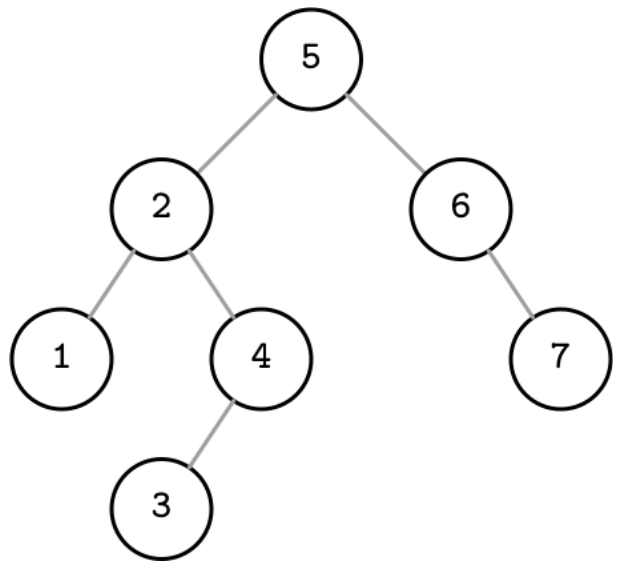

# Chapter 2. B-트리 개요

## 1. 이진 탐색 트리

---

- 이진 탐색 트리(Binary Search Tree): 정렬된 인메모리 자료 구조
    - 키-값 쌍 검색에 사용된다.
    - 키와 두 개(binary)의 자식 포인터가 저장된 여러 노드로 구성된다.
        
        
        
        2-1. 이진 탐색 트리
        
    - 각 노드의 키는 왼쪽 서브트리의 모든 노드 키보다 크고 오른쪽 서브트리의 모든 키보다 작다.
        
        
        
        2-2. 이진 트리 노드의 속성
        
    - 어떤 노드든지 값을 저장할 수 있다.
    - 탐색은 루트에서부터 시작하며, 대상 키를 찾으면 리프 레벨에 도달하기 전에 탐색이 끝날 수 있다.

### 1-1. 트리 밸런싱

---

- 균형 트리 vs 불균형 트리
    
    
    
    2-3. (a) 균형 트리 (b) 불균형 트리
    
    - 균형트리: 두 서브트리의 높이 차이가 최대 1인 트리
        - 높이: logN (밑수 2)
        - 탐색 시간 복잡도: O(logN) (밑수 2)
    - 불균형 트리
        - 최악의 시간 복잡도: O(N)
- 👉 트리의 균형을 유지하는 방법: 노드를 추가하거나 삭제한 후 트리를 회전하는 것
    
    
    
    2-4. 트리 회전 예제
    

### 1-2. 디스크 기반 스토리지용 트리

---

- BST 는 높은 트리 유지 비용 때문에 디스크 기반 자료 구조로는 적합하지 않다.
    - 트리의 팬아웃이 낮기 때문에 트리 밸런싱과 노드 재배치, 포인터 갱신이 자주 발생한다.
        - 팬아웃(fanout): 노드가 가질 수 있는 최대 자식 노드 개수

- BST 를 디스크에서 제어하면 몇 가지 문제에 직면한다.
    
    1️⃣ 지역성
    
    - 노드는 키 순서에 따라 삽입되지 않기 때문에 새로운 노드와 부모 노드가 가까운 위치에 저장되지 않을 수 있다 → 자식 포인터가 여러 다른 디스크 페이지를 가리킬 수 있다.
    
    2️⃣ 트리의 높이
    
    - 특정 노드를 찾기 위해 O(logN)번의 탐색과 디스크 전송이 필요하다.
    - 팬아웃이 낮은 트리는 인메모리 자료 구조로는 유용하지만 노드의 크기가 작은 탓에 외부 스토리지 저장에는 비효율적이라는 한계가 있다.

- 디스크 저장에 적합한 트리 특성
    - 인접한 키의 지역성을 높이기 위한 높은 팬아웃
    - 트리 순회 중 디스크 탐색 횟수를 줄이기 위한 낮은 트리 높이

## 2. 디스크 기반 자료 구조

---

- 디스크 기반 자료 구조는 메모리에 데이터 전부를 저장할 수 없을 때 주로 사용한다.
    - 데이터 일부를 메모리에 캐시하고 나머지는 효율적으로 접근할 수 있는 형태로 디스크에 저장한다.

### 2-1. 하드 디스크 드라이브

---

1. 탐색(seek) 작업이 랜덤 읽기 비용의 많은 부분을 차지한다.
    - 디스크를 회전하고 읽기/쓰기용 헤드를 원하는 위치까지 물리적으로 옮겨야 하기 때문
    - 이후의 연속된 바이트 읽기/쓰기(순차적 작업)는 상대적으로 비용이 낮다.
2. 최소 전송 단위는 섹터(sector)
    - 모든 작업은 최소 한 개의 섹터를 읽거나 쓴다.
    - 크기는 보통 512바이트에서 4Kb 사이

### 2-2. 솔리드 스테이트 드라이브

---

1. 물리적으로 움직이는 부품이 없다.
2. SSD 는 메모리 셀(cell)로 구성된다.
    
    
    
    2-5. SSD 계층
    
    - 스트링: 셀을 연결. 32~64개 셀로 구성됨
    - 페이지: 스트링의 배열. 크기는 보통 2~16Kb 👉 읽고 쓸 수 있는 가장 작은 단위
        - 비어 있는 메모리 셀(기존 값이 삭제된 셀)에만 쓸 수 있다.
    - 블록: 페이지의 모임. 일반적으로 64~512개의 페이지로 구성된다. 👉 삭제할 수 있는 가장 작은 단위
        - 16*512 = 8.192MB
        - 블록 내 페이지는 순차적으로 쓴다.
    - 플래시 변환 레이어(Flash Translation Layer): 페이지 ID 를 실제 위치와 매핑하고 비어 있거나 쓰여진 혹은 삭제된 페이지를 관리하는 플래시 메모리 컨트롤러
        - 가비지 컬렉션도 수행한다.
            - 페이지를 다른 위치로 옮기고 페이지 ID 매핑도 알맞게 수정한다.
            - 사용하지 않는 블록은 재사용할 수 있도록 삭제한다.
3. HDD 와 다르게 랜덤과 순차 I/O 의 구분이 중요하지 않다 → 둘 사이의 레이턴시가 매우 작기 때문
    - 프리페치(prefetch)와 연속된 페이지 읽기, 내부 병렬 처리 등으로 인한 차이는 여전히 존재한다.
    - 가비지 컬렉션은 보통 백그라운드 작업이지만 쓰기 성능을 저하시킬 수 있다.

❗HDD와 SSD는 개별 바이트 단위(데이터 블록 단위)가 아닌 메모리 청크 단위로 데이터를 참조한다.

- 블록 디바이스 추상화 계층
    - 대부분의 운영체제에 있다.
    - 하드 디스크의 내부 구조를 추상화하고 I/O 작업을 내부적으로 버퍼링한다.
    - 디스크 기반 자료구조 제약 사항: 블록 디바이스에서 하나의 워드를 읽으면 해당 워드를 포함하는 블록 전체를 읽게 된다.

❗전체 블록 단위로 쓰거나 같은 블록에 대한 쓰기 작업을 모아 한 번에 처리할 수 있다면 I/O 작업 수를 줄일 수 있다.

### 2-3. 디스크 기반 자료 구조

---

- 효율적인 디스크 기반 자료 구조 설계가 어려운 이유
    - 디스크 접근 비용
    - 가장 작은 작업 단위가 블록이라는 제약

- 디스크 기반 자료 구조는
    - 저장 매체의 구조를 고려해서 설계해야 하며 디스크 접근 횟수를 최소화해야 한다.
    - 내부 구조를 최적화하고 지역성을 높여 페이지를 넘나드는 포인터를 최소화해야 한다.

- B-트리: 팬아웃을 크게 하고 높이와 노드 포인터 개수, 밸런싱 빈도를 줄인 트리

## 3. 유비쿼터스 B-트리

---

- B-트리는 👉 Balance tree 중 하나
    - 검색 항목을 빠르게 찾을 수 있는 계층형 자료 구조다.

2-7. 이진 트리와 2-3 트리, B-트리 비교

- 이진 트리 노드: 원으로 표시
    - 각 노드별로 한 개의 키가 있고 탐색 공간을 두 개의 구간으로 나누기 때문
- B-트리 노드: 직사각형으로 표시
    - 자식 노드와 해당 키의 관계를 표현하기 위해 포인터 블록도 같이 표시한다.
    - 키의 순서가 보장되는 자료 구조 → 이진 탐색과 같은 알고리즘을 사용해 특정 키를 찾을 수 있다.
    - 시간 복잡도: 로그 시간

### 3-1. B-트리 계층

---

- B-트리: 여러 노드로 구성된다. 각 노드는 최대 N개의 키와 N+1개의 자식 노드 포인터를 저장한다.
    
    
    
    2-9. B-트리 노드 계층
    
    - 루트 노드: 트리의 최상위 노드로 부모 노드가 없음
    - 내부 노드: 루트와 리프 노드를 연결하는 모든 노드. 트리에는 일반적으로 한 레벨 이상의 내부 노드가 있음
    - 리프 노드: 자식 노드가 없는 트리의 최하위 계층 노드

- B-트리는 👉 페이지 기반 자료 구조. 노드와 페이지가 같은 의미로 쓰이기도 한다.
    - 고정 크기 페이지 단위로 구성 및 탐색

- 점유율(occupancy): 보유 가능한 노드 용량(capacity)과 실제로 보유하고 있는 키의 개수
- B-트리에서 팬아웃: 각 노드에 저장할 수 있는 최대 키 수

### B+-트리

---

- B-트리
    - 루트와 내부, 리프 노드가 포함된 모든 레벨에 값을 저장할 수 있는 트리
    - MySQL InnoDB 에서도 B+-트리를 B-트리라는 명칭으로 부른다.
    
- B+-트리
    - 리프 노드에만 값을 저장할 수 있다.
    - 내부 노드에는 리프 노드에 저장된 값을 찾기 위해 검색 알고리즘에 필요한 구분(separator) 키만 저장한다.
    - 상위 레벨의 노드는 노드 분할 혹은 병합이 일어날 때에만 영향을 받는다.

### 3-2. 구분 키

---

- B-트리 노드에 저장된 키 == 인덱스 엔트리, 구분 키, 또는 디바이더 셀(divider cell)이라고 부른다.
    
    
    
    2-10. 구분 키가 트리를 서브트리로 나누는 방식
    
    - 각 키는 트리를 해당 키 범위의 서브트리로 분할한다.
    - 키는 정렬돼 있기 때문에 이진 검색에 사용할 수 있다.
    - [상향식](https://www.cs.usfca.edu/~galles/visualization/BTree.html)(리프에서부터 위로)으로 트리를 구성한다.(추가될 리프 노드에 여유가 없다면 M(차수)/2 번째 키값을 부모 노드로 옮기고 좌우로 분할 후 삽입한다)
        - 이진 트리: 하향식
        - 예시: 3차 B-트리
            
            
            
            - 4를 삽입하면 노드가 가질 수 있는 최대 키의 개수를 넘기에 3(차수)/2번째 값인 2를 부모 노드로 올린다.
                
                
                
            
            
            
            - 6을 삽입할 때 또 노드가 가질 수 있는 키의 값을 넘으므로 3(차수)/2번째 값인 4를 부모 노드로 올리고, 양쪽으로 분기한 후 삽입한다.
            
            
            

### 3-3. B-트리 탐색의 시간 복잡도

---

- 전송 횟수 관점에서 복잡도의 로그 밑은 N(각 노드별 키 개수)이다.
    - 특정 키를 찾기 위해서 최대 logM (밑수 K)개의 페이지에 접근해야 한다.
        - 각 레벨에는 이전 레벨보다 K 배 많은 노드가 있고 자식 포인터를 따라가면 탐색 공간이 N 의 비율로 감소한다.
        - M: 전체 노드 개수
- 비교 횟수 관점에서 보면 각 노드 안에서 이진 탐색을 사용해 키를 찾기 때문에 복잡도의 로그 밑은 2다.
    - 비교할 때마다 탐색 공간이 절반으로 줄어들기 때문에 복잡도는 logM (밑수 2)

### 3-4. B-트리 탐색 알고리즘

---

- 탐색의 목적: 특정 키 또는 바로 앞 키를 찾는 것
    - 정확히 일치하는 키: 포인트 쿼리와 업데이트, 삭제 작업 시
        - 포인트 쿼리는 특정 키를 찾거나 찾는 데 실패했을 때 완료된다.
    - 대상 키의 바로 앞의 값: 범위 스캔과 새로운 노드 삽입 시
        - 범위 스캔은 첫 번째 키-값 쌍에서 시작해 범위의 끝에 도달하거나 더 이상 조건을 충족하지 않는 노드를 찾을 때까지 형제 노드 포인터를 따라간다.

- 탐색 알고리즘: 루트 노드에서부터 이진 검색을 수행한다.
    - 검색 키보다 큰 첫 번째 구분 키를 찾는다.
    - 대상 키를 찾아 반환하거나 트리에 존재하지 않는 키인 경우 바로 앞의 값을 반환한다.
    - 낮은 레벨로 내려갈수록 검색 범위가 줄어든다.

### 3-5. 키 개수

---

- 키와 자식 오프셋 수를 계산하는 다양한 방식
    - 방식 1. 최적의 페이지 크기를 나타내는 자연수 k 를 기반으로 계산한다.
        - 페이지에 k~2k개의 키가 있으며
        - 최소 k+1에서 최대 2k+1개 자식 노드를 가리키는 포인터를 저장할 수 있다.
        - 루트 페이지는 1~2k개의 키를 포함할 수 있으며
        - 리프가 아닌 모든 페이지는 최대 l+1개의 키를 포함한다.
    - 방식 2. 각 노드에 최대 N개의 구분 키와 N+1 포인터를 저장할 수 있다.

→ 계산한 결과는 동일하며 단지 설명하는 방식이 다를 뿐

### 3-6. B-트리 노드 분할

---

- 오버플로우 상태: 리프 노드에 남은 공간이 없는 노드 → 새로운 키를 삽입하려면 노드를 분할해야 한다.

- 노드 분할 작업의 조건
    - 리프 노드: 노드에 최대 N개의 키-값 쌍을 저장할 수 있고 새로운 키-값 쌍 삽입 시 용량이 초과되는 경우
    - 리프가 아닌 노드: 노드에 최대 N+1개의 포인터를 저장할 수 있고 포인터 추가 시 용량이 초과되는 경우

- 부모 노드에 승급 키와 포인터를 추가할 공간이 없을 경우, 부모 노드도 분할해야 한다.
- 트리에 용량이 부족하면 루트 노드를 분할해야 한다. 분할 지점의 키는 부모 노드로 승급된다.
    - 리프 노드가 분할: 노드의 절반은 그대로 두고 나머지는 새로운 노드로 옮긴다.
        
        
        
        2-11. 키 11 삽입으로 인한 리프 노드 분할. 새로운 키와 승급된 키는 회색으로 표시한다.
        
    - 비 리프 노드를 분할: 새로운 노드를 생성하고 N/2+1번 인덱스부터 모두 옮긴다.
        
        
        
        2-12. 키 11 삽입으로 인한 비 리프 노드 분할. 새로운 키와 승급된 키는 회색으로 표시한다.
        
        - 리프가 아닌 노드의 분할은 항상 하위 레벨 노드의 분할로 인해 발생하기 때문에 새로운 포인터가 추가된다.
    
    👉 리프 노드를 분할할 경우 키와 값을 모두 옮긴다.
    

- 노드 분할
    1. 새로운 노드를 할당한다.
    2. 분할 노드 키의 절반을 새로운 노드로 복사한다.
    3. 새로운 키를 알맞은 노드에 삽입한다.
    4. 분할 노드의 부모 노드에 분할 키와 새로운 노드를 가리키는 포인터를 추가한다.

### 3-7. B-트리 노드 병합

---

- 언더플로우 상황: 키를 삭제하다보면 노드에 저장된 값이 (키 개수가 일정량 이하로) 너무 적은 경우가 생기는데, 이러한 때에는 형제 노드들을 병합해야 한다.

- 노드를 병합하는 조건
    - 리프 노드: 노드에 최대 N개의 키-값 쌍을 저장할 수 있고 두 노드의 총 키-값 쌍의 수가 N보다 작거나 같은 경우
    - 리프가 아닌 노드: 노드에 최대 N+1개의 포인터를 저장할 수 있고 두 노드의 포인터 수의 합이 N+1보다 작거나 같은 경우

- 형제 노드의 부모가 같고 한 개의 노드로 합칠 수 있다면 두 노드를 병합한다.
- 만약 한 개의 노드로 합칠 수 없다면 키를 두 노드 사이에 재분배하고 균형을 맞춘다.
    - 리프 노드 병합: 한쪽 형제 노드에서 다른 쪽 형제 노드로 값을 옮긴다.
        
        
        
        2-13. 키 16의 삭제로 인한 리프 노드 병합
        
        - 일반적으로 오른쪽 노드에서 왼쪽 노드로 옮기지만 키의 순서만 보장된다면 반대로 옮겨도 상관없다.
    - 비 리프 노드: 부모 노드에서 해당 구분 키를 가져오게 된다.(즉, 키가 강등된다)
        
        
        
        2-14. 키 10의 삭제로 인한 비 리프 노드의 병합
        

- 노드 병합
    1. 모든 키를 오른쪽 노드에서 왼쪽 노드로 복사한다.
    2. 부모 노드에서 오른쪽 노드를 가리키는 포인터를 제거한다.(리프 노드 병합이 아니면 강등)
    3. 오른쪽 노드를 제거한다.