# [05] 트랜잭션 처리와 복구

- 트랜잭션이란?
    - 하나의 논리적 작업 단위
    - 여러 작업을 한 단계로 표현하는 방법
    - (여기서 작업은, 읽기와 쓰기를 모두 포함한다)
- 모든 데이터베이스 트랜잭션은 ACID를 보장한다
    - **A** : *Atomicity*
        - 원자성
        - 모두 실행되거나 모두 실패해야 한다
        - (커밋되거나, 롤백하거나 둘 중 하나)
        - 즉, 부분적으로 실행될 수 없다
    - **C** : *Consistency*
        - 일관성
        - 참조 무결성 등의 제약조건을 위반하지 않고, 유효한 상태에서 또 다른 유효한 상태로 변경한다
        - 데이터베이스가 아닌 사용자가 제어할 수 있는 유일한 속성이다
    - **I** : *Isolation*
        - 격리성
        - 동시에 수행되는 모든 트랜잭션은 다른 트랜잭션이 존재하지 않는 것처럼, 서로 간섭없이 수행되어야 한다
        - 격리성은 ‘수정 내용이 반영되는 시점’과 ‘동시 수행중인 트랜잭션이 접근할 수 있는 데이터’를 정의한다
        - 동시성 제어 방식에 따라 트랜잭션의 변경 내용 중 일부가 동시 수행 중인 다른 트랜잭션에 노출될 수 있고 노출되지 않을 수 있다
        - 많은 데이터베이스는 성능상의 이유로 여기서 설명한 격리성의 정의에 비해 약한 격리 수준을 사용한다
    - **D** : *Durability*
        - 트랜잭션 커밋 후, 디스크에 저장된 데이터베이스의 상태는 시스템이 중단되거나 정전 또는 시스템 장애가 발생해도 그대로 유지되어야 한다

# 버퍼 관리

---

- 페이지 캐시
    - 대부분의 데이터베이스의 구조 = 속도가 느린 디스크 + 빠른 메모리 *(메모리 계층 구조)*
        
        → 디스크 접근 횟수를 줄이기 위해 페이지를 메모리에 **캐싱한다**
        
    - 페이지를 요청하면, 캐시에서 반환한다
        - 다른 프로세스가 디스크에 저장된 같은 페이지를 변경하지 않으면, 메모리에 캐시된 **페이지**를 **재사용**할 수 있다
        (페이지 재요청 시, 캐시에서 반환)
        - 메모리에 없는데요?
            - 요청된 페이지가 메모리에 없을 경우에만 물리적 저장소에 접근한다
    
    **⇒ 이와 같은 방식을 ‘페이지 캐시’라고 한다**
    
    - 페이징
        - 아직 캐시되지 않은 페이지를 디스크에서 메모리로 복사하는 작업
        - 페이지 캐시의 메모리 영역은 전체 데이터셋보다 작기 때문에, 영역이 모두 사용되었다면, 새로운 페이지를 추가하기 위해 기존 페이지를 만료시킨다
    - 페이지 캐시는, 시스템 장애가 발생하거나 시스템이 비정상적으로 종료되면 캐시된 데이터가 사라진다
- 페이지 캐시의 주요 기능
    - 페이지 내용을 메모리에 캐시한다
        - 디스크의 변경사항을 함께 버퍼링하고, 캐시된 페이지에 반영한다
    - 캐시된 페이지가 요청된 경우, 메모리에서 반환한다
    - 캐시되지 않은 데이터가 요청된 경우, 메모리에 공간이 충분하다면 페이징하고 캐시된 버전을 반환한다
        - 메모리에 새로운 페이지를 추가할 공간이 없을 경우, 일부 페이지를 만료시키고 디스크 페이지로 플러시한다
- 디스크 페이지와 캐시된 페이지와의 관계
    
    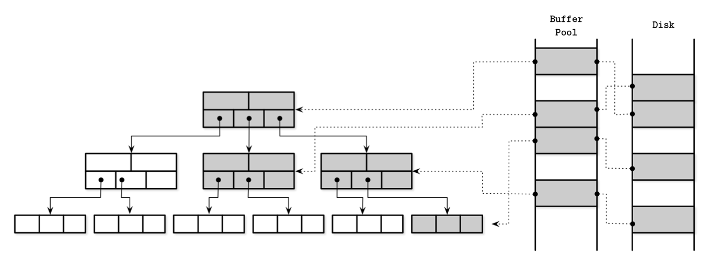
    
    - 페이지 캐시는 순서를 고려하지 않고 페이지를 빈 슬롯에 복사한다
    - 따라서 디스크와 메모리에서 페이지가 정렬되는 방식 사이에는 연관성이 없다

### 캐싱

- 버퍼에 대한 변경 사항은 디스크에 쓰기 전까지 메모리에 남겨둔다
- 동기화 : 메모리에서 디스크로 플러시하는 작업 (단방향이다. 메모리→디스크)
- 특정 페이지가 요청되면,
    1. 우선 캐시된 버전이 있는지 확인한다
    2. 있다면 반환한다
    3. 없으면 논리적 페이지 주소를 물리적 주소로 변환하여 해당 페이지를 메모리에 복사하고, 반환한다
    (해당 페이지가 저장된 버퍼를 ‘참조’ 상태라고 표현한다)
    4. 작업이 끝나면, 해당 페이지를 페이지 캐시에 반환 또는 참조해제해야 한다
    (페이지를 고정시키면 페이지 캐시에서 제거되지 않는다)
- 페이지가 변경되면 😮?
    
    → 페이지에 더티 플래그를 설정한다
    
    - 더티 플래그?
        - 해당 페이지가 디스크와 동기화되지 않은 상태다
        - 지속성을 위해 디스크로 플러시되어야 한다

### 캐시 만료

- 캐시 만료
    - 페이지 캐시의 크기는 한정적이다
    - 따라서 새로운 페이지를 저장하기 위해서 오래된 페이지는 제거되어야 한다
    - 페이지가 동기화됐고, 고정 또는 참조 상태가 아니라면 바로 제거될 수 있다
        - 더티 페이지
            - 디스크로 플러시되지 않은 변경된 페이지
            - 더티 페이지는 제거되기 전에 먼저 플러시되어야 한다
        - 참조 상태의 페이지
            - 참조 상태의 페이지는 사용이 끝날때까지는 제거될 수 없다
- 플러시와 성능
    - 페이지를 제거할 때마다 디스크로 플러시하면 **성능을 저하**시킬 수 있다
    - 따라서 일부 데이터베이스는 제거될 가능성이 높은 더티 페이지를 백그라운드에서 주기적으로 디스크로 플러시한다
        - PostgreSQL의 Background flush writer
            
            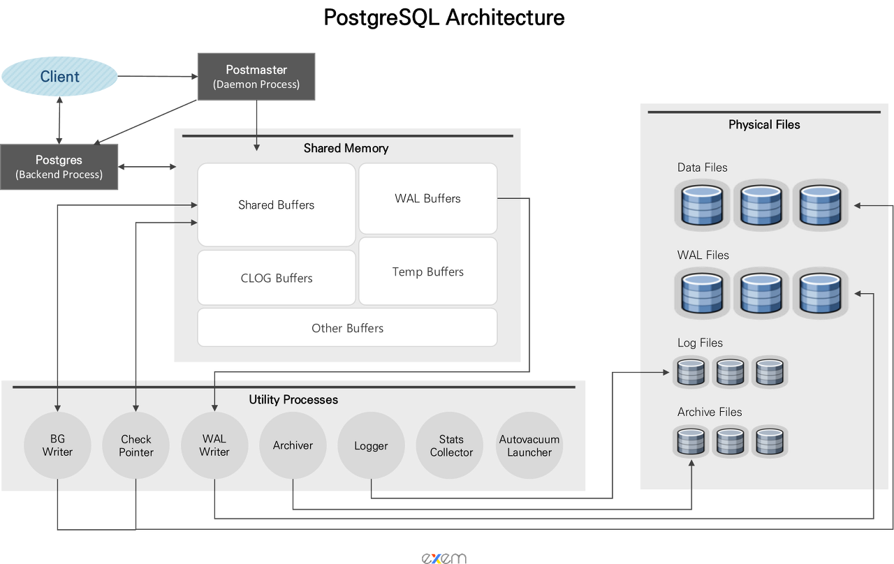
            
            - Shared Buffer의 Dirty Block을 디스크에 기록하는 프로세스
            - `bgwriter_delay` 주기로 최대 `bgwriter_lru_maxpages` 를 디스크에 기록한다
            - 주기적으로 Dirty Block을 디스크에 기록해두면, Checkpoint 발생 시 Flush 해야 하는 Dirty Block의 양을 줄일 수 있어 안정적인 I/O를 유지할 수 있다
        - MySQL의 버퍼풀 플러시
            - 더티 페이지들을 디스크에 동기화하기 위해 다음과 같은 2가지 플러시 기능을 백그라운드로 실행한다
                - 플러시 리스트 플러시
                    - 주기적으로 플러시 리스트 플러시 함수를 호출한다
                    - 함수가 호출되면, 플러시 리스트에서 오래전에 변경된 데이터 페이지 순서대로 디스크에 동기화한다
                    - 관련 시스템 변수
                        - `innodb_max_dirty_pages_pct` : 더티 페이지 비율 (전체 버퍼풀이 가진 페이지의 몇 퍼센트까지 더티 페이지를 가질 수 있는가?)
                        - `innodb_max_dirty_pages_pct_lwm` : 일정 수준 이상의 더티 페이지가 발생하면 조금씩 더티 페이지를 디스크로 기록한다 (급작스럽게 디스크 쓰기가 폭증하는 현상을 완화시키기 위함)
                        - : (이외의 설정은 생략하였음)
                - LRU 리스트 플러시
                    - LRU 리스트에서 사용 빈도가 낮은 데이터 페이지들을 제거해서 새로운 페이지들을 읽어올 공간을 만들어야 한다
- 데이터 손실
    - 데이터베이스에 장애가 발생하면 플러시되지 않은 데이터는 손실된다
    - 데이터 손실을 줄이기 위해 ‘**체크포인트**’가 플러시 시점을 제어한다
    - 체크포인트 프로세스는 선행 기록 로그(WAL)와 페이지 캐시의 싱크가 맞도록 조정하고,
    오직 플러시가 완료된 캐시된 페이지와 관련된 로그만 WAL에서 삭제될 수 있게 한다
    - 이 과정이 완료될 때까지 더티페이지는 제거될 수 없다
- 캐싱의 트레이드오프
    - 결국, 캐싱에는 트레이드오프가 있다
    - 디스크 액세스를 줄이기 위해 캐싱을 하지만, 데이터 손실 가능성이 있다
    - 적절한 트레이드오프를 위한 선택안
        - 디스크 접근 횟수를 줄이기 위해 플러시 시점을 낮춘다
        - 페이지를 우선적으로 플러시해 빠르게 캐시에서 제거한다
        - 제거할 페이지를 선택하고 최적의 순서로 플러시한다
        - 캐시 크기를 메모리 범위 내로 유지한다
        - 기본 저장소에 저장되지 않은 데이터는 손실되지 않아야 한다

### 페이지 고정

- 페이지 고정
    - 가까운 시간 내에 요청될 확률이 높은 페이지는 고정시킬 수 있다
    - 고정된 페이지는 메모리에 더 오랫동안 유지되기 때문에 디스크 접근 회수가 줄어들고 성능에 도움이 된다
- 상위 레벨 노드의 페이지 고정
    - 트리의 상위 레벨은 하위 레벨보다 노드에 비해 극히 일부분이다
    - 또한, 대부분의 읽기 작업에서 상위 레벨노드에 접근하며 분할과 병합도 결국 상위 노드로 전파된다
    - 따라서, 트리의 일부라도 캐시하면 상당한 도움이 될 수 있다
    - 상위 레벨 노드를 메모리에 고정시키고 나머지 노드는 요청 시 페이징해도 된다
    - 이 방식은, 쿼리 요청마다 디스크에 h번 접근하지 않아도 된다 (h:트리의 높이)
        - 캐시되지 않은 하위 레벨 노드만 디스크에서 읽는다

### 페이지 교체 알고리즘

- 저장 공간이 부족한 캐시에 새로운 페이지를 추가하려면 일부 페이지를 만료시켜야 한다
- 빈번하게 요청될 수 있는 페이지를 만료시키면, 같은 페이지에 여러 차례 페이징하는 상황이 발생한다
    
    → 따라서, ‘페이지 교체 알고리즘’이 필요하다
    
- 페이지 교체 알고리즘
    - 페이지 캐시의 성능을 결정한다
    - 캐시된 페이지는 이 ‘페이지 교체 알고리즘’에 따라 캐시에서 제거된다
    - 다시 요청될 확률이 가장 낮은 페이지를 만료시키고 해당 위치에 새로운 페이지를 페이징한다
    - 근데, 다시 요청될 확률이 가장 낮은 페이지를 어떻게 찾아? 🤔
        
        → 알고리즘마다 다르다
        
- 페이지 교체 알고리즘 종류
    - LRU
        - FIFO
            - 선입선출
            - 가장 단순한 페이지 교체 알고리즘
            - 페이지 id를 삽입 순서대로 큐의 끝에 추가한다
            - 페이지 캐시에 공간이 부족할 경우 큐의 헤드에 저장된 페이지 id가 가리키는 가장 오래된 페이지를 만료시킨다
        - LRU
            - 확장된 FIFO
            - 삽입 순서대로 큐에 추가한다
            - 하지만 페이지가 재요청되면 마치 처음 페이징된 것처럼 다시 큐의 끝에 추가한다
            - 즉, 페이지를 요청할 때마다 페이지에 대한 참조와 노드를 갱신해야 한다 → 동시 접근 환경에서는 매우 비효율적일 수 있다
        - 2Q LRU
            - Two Queue LRU
            - 2개의 큐를 사용한다
            - 최초 페이징 시 첫 번째 큐에 삽입한다
            - 재요청이 되면 두 번째 큐로 옮긴다
            - 최근 요청된 페이지와 자주 요청된 페이지를 구분한다
            - MySQL LRU리스트
                - MySQL에서는 LRU리스트를 사용한다
                - 엄밀히 따지면, LRU 리스트 + MRU 리스트다 (결합된 상태)
                    
                    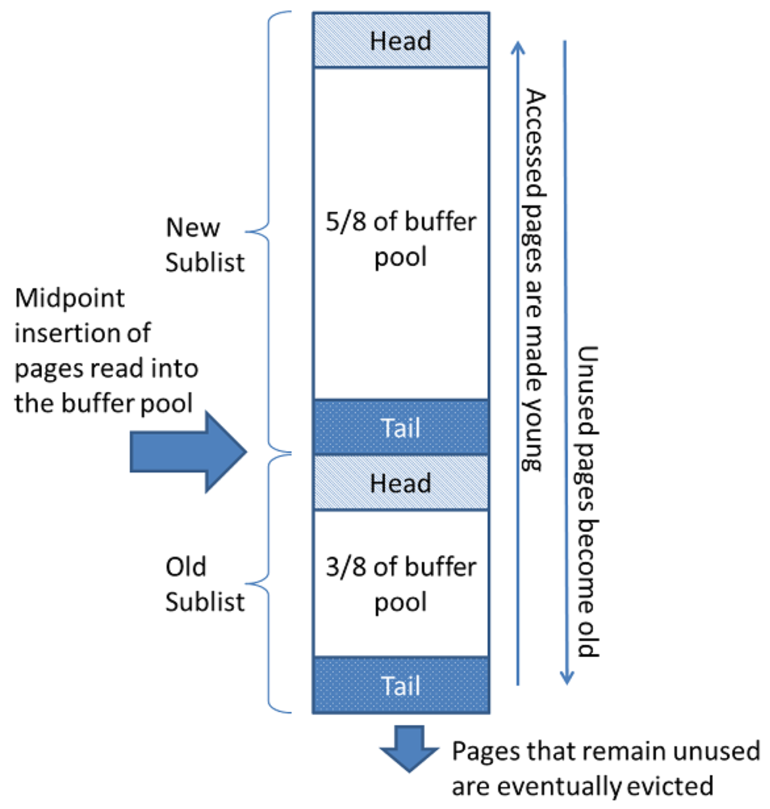
                    
                - midpoint insertion (중간지점 삽입 전략)
                    - 새로운 페이지를 버퍼풀에 추가하기 위한 페이지 공간이 필요한 경우,
                    접근이 가장 오래된 페이지를 선정하여 버퍼풀에서 제거하고, 새로운 페이지를 리스트의 중간지점에 삽입한다
                - New Sublist가 MRU, Old Sublist가 LRU
                - 버퍼 풀의 데이터 페이지가 쿼리에 의해 사용되면 나이가 초기화되어 다시 젊어지고 MRU의 헤더 부분으로 옮겨진다
                - 즉, 버퍼 풀 내부에서 최근 접근 여부에 따라서 데이터 페이지는 서로 경쟁하면서 MRU 또는 LRU로 이동한다
                - 그리고 LRU 끝으로 밀려난 데이터 페이지들을 버퍼 풀에서 제거해서 새로운 데이터 페이지를 적재할 수 있는 빈 공간을 준비한다
        - LRU-K
            - 마지막으로 참조된 k개의 페이지를 기반으로 자주 요청되는 페이지를 구분하고 페이지별 요청 횟수를 예측한다
            - 예시
                
                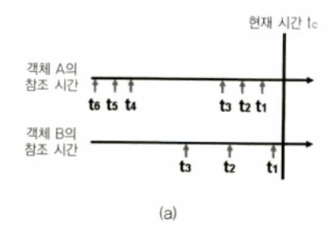
                
                - LRU에서는.. → 마지막 참조 시간인 t1 을 비교할 경우, B의 t1이 더 최근과 가까우므로 “A < B” 로 가치평가
                - LRU-3에서는.. → 끝에서 세번째 참조 시간인 t3를 비교할 경우, A의 t3가 더 최근과 가까우므로 “A > B”로 가치평가
    - CLOCK
        - 어떤 상황에서는 정확성보다 효율성이 더 중요하다
        - CLOCK 알고리즘
            - 단순하고, 캐시친화적이며, 동시성을 지원한다
            - 페이지에 대한 참조와 접근 여부를 나타내는 비트를 원형 버퍼에 저장한다
            - 페이지가 요청될 때마다 해당 페이지의 접근 비트를 1로 설정한다
            - 원형 버퍼를 순회하면서 접근 비트를 확인한다
                
                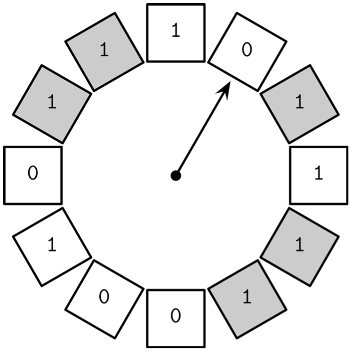
                
                - 접근 비트가 1이다
                    - 페이지가 참조중이 아니라면, 접근 비트를 0으로 설정한다
                - 접근 비트가 0이다
                    - 제거 대상이다
                    - 만료 작업을 스케줄링
        - CLOCK-sweep
            - Clock 알고리즘에서 단순 비트 대신 요청 횟수를 나타내는 카운터를 사용한다
            - 버퍼 메타데이터를 관리하는 버퍼 디스크립터를 순환하며 스캔하여 사용횟수를 감소시켜 미사용 버퍼를 탐색한다
            - [https://github.com/meeeejin/til/blob/master/dbms/a-comparison-of-buffer-management-algorithms.md#페이지-교체-알고리즘-clock-sweep](https://github.com/meeeejin/til/blob/master/dbms/a-comparison-of-buffer-management-algorithms.md#%ED%8E%98%EC%9D%B4%EC%A7%80-%EA%B5%90%EC%B2%B4-%EC%95%8C%EA%B3%A0%EB%A6%AC%EC%A6%98-clock-sweep)
            - NFU 알고리즘의 일종이다
    - LFU
        - LFU
            - Least Frequently Used
            - 페이징 횟수 대신 페이지가 **참조된 횟수**를 기반으로 제거할 페이지를 선택하는 방법
            - 결국, 요청 빈도가 가장 낮은 페이지가 제거된다
        - TinyLFU
            - 캐시 접근 이력을 빈도수 히스토그램에 저장하여 **요청 빈도 기반으로** 페이지의 만료 여부를 결정한다
            - TinyLFU는 3가지 큐를 사용한다
                - **등록 큐** : LRU 알고리즘을 기반으로 새로 추가된 페이지를 저장
                - **관찰 큐** : 제거될 확률이 높은 페이지를 저장한다
                - **보호 큐** : 큐에 오랫동안 남아있을 페이지를 저장한다
            - **등록큐 → 관찰큐** : 요청 빈도가 높은 페이지를 관찰 큐로 옮긴다
            - **관찰큐 → 보호큐** : 관찰큐에서  다시 요청되면 보호 큐로 옮긴다
            - **보호큐 → 관찰큐** : 보호 큐가 가득 차면 일부 페이지를 다시 관찰 큐로 옮긴다
                
                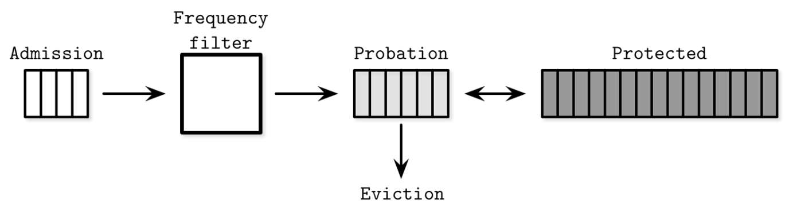
                
            - 즉, 요청 빈도가 높은 페이지일수록 큐에 더 오랫동안 유지되고 요청빈도가 낮은 페이지는 제거될 확률이 높다
            - 예 : 자바 카페인 캐시
                
                [https://github.com/ben-manes/caffeine/wiki/Efficiency](https://github.com/ben-manes/caffeine/wiki/Efficiency)
                
- 페이지 교체 알고리즘은 시스템의 레이턴시와 I/O 작업 횟수에 큰 영향을 미치기 때문에, 신중하게 선택해야 한다

# 복구

---

- WAL(선행 기록 로그 또는 커밋 로그)는 장애 및 트랜잭션 복구를 위해 디스크에 저장하는 append only 자료구조다
- WAL은 캐시된 내용이 디스크로 플러시될 때까지의 관련 작업 이력의 유일한 디스크 복사본이다
- WAL의 주요 기능
    - 디스크에 저장된 페이지에 대한 변경사항을 페이지 캐시에 **버퍼링**하는 동시에 데이터베이스 시스템 맥락에서의 **지속성을 보장**한다
    - 데이터베이스의 상태를 변경하는 모든 작업을 실제 페이지에 적용하기 전에 먼저 디스크에 로깅하며,
    캐시된 페이지가 디스크와 동기화될 때까지 작업 이력을 디스크에 저장한다
    - 장애 발생 시, 로그를 기반으로 마지막 메모리 상태를 재구성한다

### 로그의 시맨틱

- WAL은 append-only 자료구조이다
- 작성된 데이터는 불변이다
- WAL은 여러 로그 레코드로 구성되는데, 모든 레코드에는 고유 로그 시퀀스 번호인 **LSN**이 있다
    - (일반적으로 LSN은 내부 카운터 값 또는 타임스탬프 값이다)
- 버퍼링
    - 로그 레코드의 크기는, 디스크 블록보다 크기가 작을 수 있다
        - → 따라서 버퍼링할 수 있다
    - 로그 버퍼에 임시 저장했다가 force 작업 시 디스크로 플러시한다
    - (모든 로그 레코드는 LSN과 동일한 순서로 플러시되어야 한다)
- WAL과 커밋
    - WAL은 트랜잭션 완료 여부를 나타내는 레코드를 저장한다
    - 트랜잭션 커밋 레코드의 LSN까지 플러시되기 전까지는 해당 트랜잭션은 커밋된 것으로 간주하지 않는다
- 체크포인트
    - 체크포인트란..? → 해당 시점 이전의 모든 로그 레코드가 플러시됐고 더이상 필요하지 않다는 것을 명시한다
    - 체크포인트 작업이 완료될때까지 다른 작업을 모두 중지해야 한다
        - ’로그 정리 작업’과 ‘데이터를 기본 스토리지에 저장하는 작업’이 조금이라도 어긋나면 데이터는 손실될 수 있기 때문
    - sync 체크포인트
        - 모든 더티 페이지를 강제로 디스크로 플러시해 기본 저장소와 완전히 동기화하는 작업을 말한다
        - 이 작업은 당연히 비효율적이다
    - fuzzy 체크포인트
        - sync 체크포인트는 너무 비효율적이기 때문에, 대부분의 데이터베이스는 fuzzy 체크포인트를 사용한다
        - `last_checkpoint` 포인터
            - 로그 헤더에 저장된다
            - 마지막으로 성공한 체크포인트 작업에 대한 정보가 저장된다
        - `begin_checkpoint` 와 `end_checkpoint`
            - 퍼지 체크 포인트는 `begin_checkpoint`로 시작하여, `end_checkpoint`로 끝난다
            - 페이지는 **비동기**적으로 플러시된다
            - 이 로그 레코드에 명시된 모든 페이지가 플러시될 때까지 해당 체크포인트는 미완료 상태다
            - 작업이 끝나면 `last_checkpoint` 레코드를 `begin_checkpoint` 의 LSN으로 업데이트한다
        - 장애가 발생하면, 해당 `last_checkpoint` 의 LSN에서부터 시작한다

### 작업 로그 대 데이터 로그

- Shadow Paging
    - 새로운 데이터를 우선 내부 섀도 페이지에 쓰고, 이전 버전의 페이지를 가리키는 포인터를 섀도 페이지를 가리키도록 변경해 업데이트된 내용을 반영하는 방법
        
        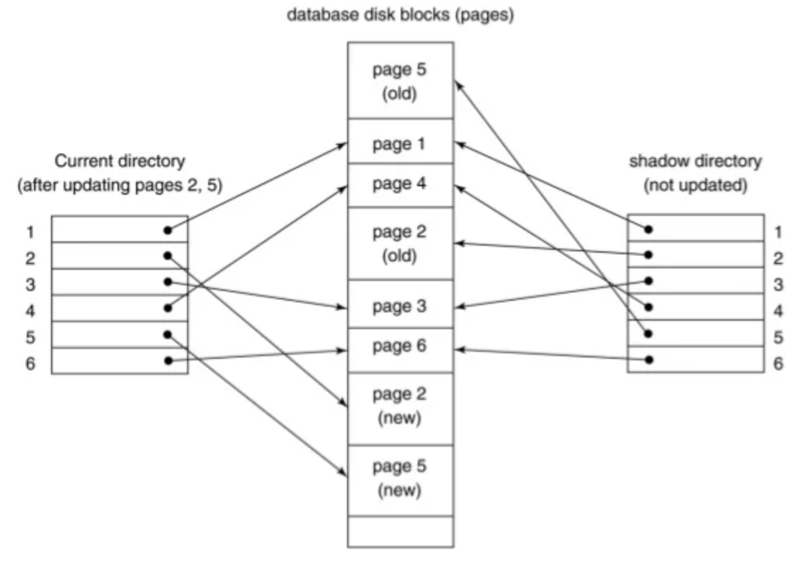
        
- Redo와 Undo
    - 모든 상태 변화는 이전 상태와 이후 상태의 조합으로 나타낼 수 있다
        - 이전 상태에 Redo 작업을 수행하면, 이후 상태가 된다
        - 이후 상태에 Undo 작업을 수행하면, 이전 상태가 된다
- 물리적 로그와 논리적 로그
    - 물리적 로그와 논리적 로그를 사용하여 레코드와 페이지 상태를 한 상태에서 다른 상태로 되돌리거나 재구성할 수 있다
        - 물리적 로그
            - 전체 페이지 상태 또는 바이트별 변경 사항
            - 물리적 로그에는 수행 전후의 상태를 모두 저장한다 → 로깅 대상 작업에 의해 영향받은 모든 페이지를 참조해야 한다
        - 논리적 로그
            - 현재 상태에 대해 수행해야 하는 작업
            - 논리적 로그에는 페이지에 수행해야 하는 작업을 지정한다 (‘Y 키에 레코드 X 삽입’, ‘Y 키의 값 삭제’)
    - 리두 작업에는 복구 시간 단축을 위해 물리적 로그를 사용하고,
    언두 작업에는 동시성과 성능을 위해 논리적 로그를 사용한다

### 스틸과 포스 정책

- DBMS는 스틸/노스틸, 포스/노포스 정책을 기반으로 메모리에 캐시된 변경사항을 디스크로 플러시하는 시점을 결정한다
- 스틸과 노스틸
    - 스틸 : 트랜잭션이 수정한 페이지를 커밋하기도 전에 플러시하는 것을 허용한다
        - (더티페이지를 스틸한다)
    - 노스틸 : 커밋되지 않은 트랜잭션이 디스크로 플러시되는 것을 허용하지 않는다
- 포스와 노포스
    - 포스
        - 트랜잭션이 수정한 모든 페이지를 커밋 전에 플러시한다
        - 따라서 장애 복구시 트래잭션의 커밋 결과를 재구성하지 않아도 된다
        - 하지만, 많은 I/O로 인해 트랜잭션 커밋 시간이 증가한다
        - (더티페이지를 포스한다)
    - 노포스
        - 일부 페이지가 디스크로 플러시되지 않았더라도 트랜잭션 커밋을 허용한다
        - 플러시 시점을 늦추면 더 많은 변경사항을 버퍼링할 수 있다
        - 하지만 페이지를 더 오랫동안 캐시해야 한다 (더 큰 페이지 캐시가 필요하다)
- 언두 또는 리두 로그를 로그 파일에 **쓰기 전까지** 트랜잭션을 **커밋할 수 없다**
    - 트랜잭션에서 수정한 **페이지가 플러시되면**, 해당 내용을 롤백할 수 있도록 커밋할 때까지 언두 관련 정보를 로그에 유지해야 하기 때문
    - 트랜잭션에서 수정한 **플러시되지 않았다면**, 리두 레코드를 로그에 유지해야 되기 때문

### ARIES

- 스틸/노포스 정책 기반의 복구 알고리즘
- ARIES는 빠른 복구를 위해 물리적 리두 로그를 사용하고, 일반 작업의 동시성을 높이기 위해 논리적 언두를 사용한다
- 장애 발생 후 시스템을 재시작 하는 단계 : 분석→리두→언두
    - 분석
        - 페이지 캐시에 저장된 더티 페이지와 장애 발생 당시 수행중이던 트랜잭션을 파악한다
        - 더티 페이지에 대한 정보를 기반으로 리두 단계의 시작 지점을 결정한다
        - 트랜잭션 목록은 언두 단계에서 미완료된 트랜잭션을 롤백하는데 사용한다
    - 리두
        - 장애가 발생하기 전까지의 작업을 재수행하고 데이터베이스를 이전 상태로 복원한다
        - 불완전한 트랜잭션 뿐만 아니라, 커밋됐지만 결과가 디스크로 플러시되지 않은 트랜잭션을 롤백하기 위한 준비 단계다
    - 언두
        - 불완전한 트랜잭션을 롤백하고 데이터베이스를 마지막 일관된 상태로 복원한다
        - 모든 작업은 실제 수행 순서의 역순으로 롤백된다
        - 복구 중에도 장애가 발생할 수 있기 때문에 언두 작업도 로그에 기록해야 한다
- ARIES는 오늘날에도 트랜잭션 처리와 복구에 사용된다

# 동시성 제어

---

- 동시성 제어 : 동시에 수행되는 여러 트랜잭션 사이의 상호작용을 제어한다
- 동시성 제어 종류
    - 낙관적 동시성 제어 (OCC)
        - Optimistic Concurrency Control
        - 여러 트랜잭션이 동시에 읽고 쓰는 것을 허용한다
        - 결합된 여러 작업의 직렬화 가능성 여부를 결정한다
        - 트랜잭션이 서로 간섭하지 않고 각자의 작업 내역을 유지할 수 있게 하고, 커밋 전에 충돌이 발생할 수 있는지 확인한다
        - 충돌이 발생할 경우 트랜잭션 중 하나를 중단한다
    - 비관적 동시성 제어 (PCC)
        - Pessimistic Concurrency Control
        - 잠금 기반 방식과 무잠금 방식이 있다
            - 잠금 기반 방식 : 각 트랜잭션은 다른 트랜잭션이 같은 레코드를 동시에 수정 및 접근할 수 없도록 레코드에 대한 잠금을 획득한다
                - (여러 트랜잭션이 서로 잠금을 해제하기를 기다리는 교착상태가 발생할 수 있다)
            - 무잠금 방식 : 읽기와 쓰기 작업에 대한 목록을 유지하고, 완료되지 않은 트랜잭션의 스케줄에 따라 다른 트랜잭션의 수행을 제한한다
    - 다중버전 동시성 제어 (MVCC)
        - Multi Version Concurrency Control
        - 여러 버전의 레코드를 저장해 과거의 특정 타임스탬프의 데이터베이스의 일관성을 보장한다
        - MVCC는 하나의 트랜잭션만을 채택하는 검증 기법을 사용해 구현하거나, 무잠금 방식(ex. 타임스탬프 순서화 기법) 또는 잠금 기반 방식(ex. 2단계 잠금)으로도 구현할 수 있다

### 직렬화 가능성

- 데이터베이스 관점에서의 ‘스케줄’이란?
    - 트랜잭션을 수행하는데 필요한 작업의 목록
    - 목록에 포함되지 않은 다른 작업은 부작용이 없다
    - 스케줄은 논리적으로 전체 작업 목록과 동일하지만, ACID 속성과 트랜잭션 결과의 정확성이 보장될 경우 일부 작업이 병렬 수행되거나 성능을 위해 수행 순서가 뒤바뀔 수 있다
    - 직렬 스케줄
        - 포함된 모든 트랜잭션이 교차하지 않고 완전히 독립적으로 수행될 수 있는 스케줄
        - 직렬 스케줄의 모든 트랜잭션은, 다음 트랜잭션이 시작되기 전에 수행이 완료된다
        - 항상 트랜잭션을 하나씩 실행하면, 시스템의 처리량과 성능이 저하된다
- ‘직렬화가 가능하다’
    - 직렬화 가능한 스케줄의 결과는 트랜잭션을 임의의 순서로 순차 수행한 결과와 같다
    - 동일한 트랜잭션 집합에 대한 완전한 직렬 스케줄 중에서, 동일한 스케줄이 있을 경우 해당 스케줄은 **‘직렬화가 가능하다’**고 한다
    
    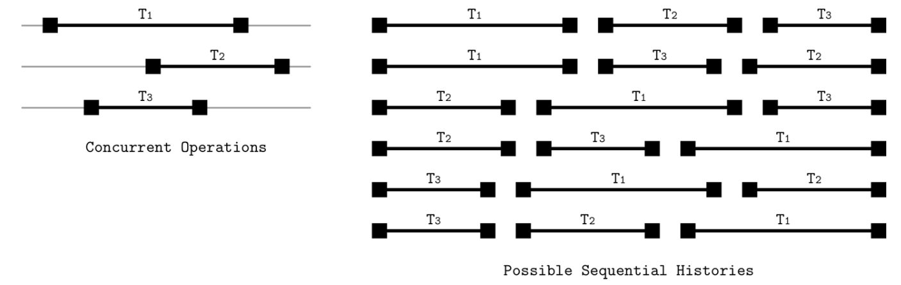
    

### 트랜잭션 격리

- 격리 수준는..
    - 각각의 트랜잭션이 고립된 정도를 정의한다
    - 트랜잭션이 변경한 내용 중 어떤 부분이 언제 다른 트랜잭션에서 접근할 수 있는지를 정의한다
    - 트랜잭션들이 수행 중에 어떤 이상현상이 발생할 수 있는지를 나타낸다

### 읽기와 쓰기 이상 현상

- 여러 트랜잭션이 동시 수행될 때 발생할 수 있는..
    - 읽기 이상 현상
        - Dirty Read
            - 아직 커밋되지 않은 다른 트랜잭션의 결과를 읽는 현상
            - 예)
                1. 트랜잭션 T1이 사용자의 주소를 업데이트한다
                2. T2는 T1의 업데이트된 주소를 읽는다
                3. T1이 실패하고 롤백된다
        - Non-Repeatable Read
            - 트랜잭션이 동일한 로우를 두번 쿼리했을 때 둘의 결과가 다른 현상을 나타낸다
            - 예)
                1. T1이 A 로우를 읽는다
                2. T2가 A 로우를 수정하고 커밋한다
                3. T1이 A 로우를 다시 읽는다
        - Phantom Read
            - 여러 로우를 두 번 쿼리 했을 때 결과가 다른 현상이다
            - 예
                1. T1이 B~D 로우를 읽는다 → B,D가 읽혔다
                2. T2가 B~D 로우 사이에 C를 저장한다
                3. T1이 B~D 로우를 다시 읽는다 → B,C,D가 읽힌다
    - 쓰기 이상 현상
        - Lost Update
            - 트랜잭션이 같은 값을 수정할 때 발생한다
            - 예
                1. T1과 T2가 각각 V를 읽는다
                2. T1는 V를 수정하고 커밋한다
                3. T2도 V를 수정하고 커밋한다
                4. T1가 갱신한 값이 사라진다
        - Dirty Write
            - 트랜잭션이 커밋되지 않은 값을 읽고(Dirty Read) 수정 및 커밋한다
            - 커밋되지 않은 값에 따라 트랜잭션의 결과가 바뀔 수 있다
        - Write skew
            - 개별 트랜잭션은 불변 조건을 충족하지만 동시 수행 시 조건이 위반된다
            - 예)
                - A1, A2 계좌에는 각각 $100, $150이 있다 (두 계좌 잔앱의 합은 $250)
                - 두 계좌 잔액의 합은 음수가 아닌 한, 잔액이 음수가 될 수 없다 (A1+A2≥0)
                1. T1과 T2는 A1, A2에서 각각 $200씩 인출한다
                2. 각 트랜잭션은 조건을 위반하지 않기 때문에 커밋한다
                3. 조건이 위배된다

### 격리 수준

- Read Uncommitted
    - 가장 낮은 격리 수준이다
    - Drity Read를 허용한다
        - 트랜잭션은 동시 수행중인 다른 트랜잭션이 커밋하지 않은 데이터를 읽을 수 있다
- Read Committed
    - 트랜잭션이 오직 커밋된 데이터만을 읽게 한다
    - Dirty Read는 발생하지 않는다
    - 하지만, Non-Repeatable Read와 Phantom Read를 허용한다 (읽기 요청을 여러번 하면)
- Repeatable Read
    - Non-repeatable read를 허용하지 않는다
    - Phantom Read는 허용한다
- Serializable
    - 가장 높은 격리 수준이다
    - 동시성을 지원하지 않는 데이터베이스는 성능이 매우 떨어지기 때문에,
    불변조건을 위반하지 않고 트랜잭션을 수행할 수 있다면, 트랜잭션의 순서는 바뀔 수 있다

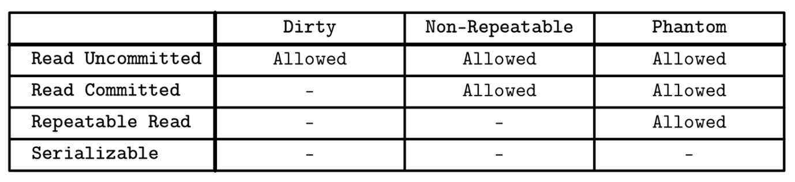

- 직렬화 가능성
    - 서로 의존성이 없는 트랜잭션은 완전히 독립적이기 때문에 임의의 순서로 수행해도 된다
    - 수행 순서에 대한 특정 순서를 강제하거나 미리 정의하지 않는다
    - 직렬화 가능성을 구현하려면 코디네이션 과정이 더 필요하다
        - 동시 수행중인 트랜잭션이 조건을 위반하지 않도록 한다
        - 충돌이 발생하는 트랜잭션은 순차적으로 수행한다
- 스냅숏 격리
    - 일부 데이터베이스는 스냅숏 격리를 지원한다
    - 각 트랜잭션은 시작 당시의 커밋된 내용을 확인한다
    - Lost Update는 발생하지 않는다
        - 데이터의 스냅샷을 생성하고 이에 대해 쿼리하며, 트랜잭션 수행 중에는 스냅샷을 변경할 수 없다
        - 해당 트랜잭션에서 수정한 값이 다른 트랜잭션에 의해 수행 중에 변경되지 않은 경우에만 커밋될 수 있다
            - 변경됐다면 중단 후 롤백된다
        - 두 개의 트랜잭션이 같은 값을 수정할 경우, 한 개의 트랜잭션만이 커밋될 수 있다
            - 즉, Lost Update는 발생하지 않는다
        - 예시
            1. T1과 T2는 동시에 V를 수정하기 위해 트랜잭션 시작 당시의 커밋된 데이터의 스냅샷에서 V를 읽는다
            2. T1이 먼저 커밋을 시도하여 커밋된다
            3. T2는 중단된다
            4. 실패한 T2는 값을 덮어쓰지 않으며, 작업을 재시도한다
    - Write skew가 발생한다
        - 두 개의 트랜잭션이 각자의 스냅샷에서 값을 읽고, 각각 수정한 결과가 조건을 위반하지 않는다면 모두 커밋이 허용된다

### 낙관적 동시성 제어

- 낙관적 동시성 제어는 *‘트랜잭션 충돌이 거의 발생하지 않는다’*고 가정한다 (~~행복회로를 돌린다~~)
    - 잠금과 블로킹 트랜잭션을 사용하지 않는다
    - 다만, 결과를 커밋하기 전에 트랜잭션을 검증하여 동시 수행 트랜잭션의 읽기/쓰기 충돌을 방지하고 직렬화 가능성을 확인한다
- 낙관적 동시성 제어의 트랜잭션 단계 : **읽기 → 검증 → 쓰기**
    - 읽기
        - 트랜잭션은 자신이 변경한 내용을 다른 트랜잭션에서 볼 수 없도록 **개별 컨텍스트**에서 트랜잭션 단계를 수행한다
        - 이 단계 후에는 모든 트랜잭션 존속성(읽기 대상)과 효과(쓰기 대상)을 알 수 있다
    - 검증
        - 동시 수행 트랜잭션의 읽기와 쓰기 대상에서 직렬화 가능성을 보장하지 않는 충돌이 발생할 수 있는지 확인한다
            - 트랜잭션이 쿼리한 데이터가 최신이 아니거나,
            - 읽기 단계 중에 수정 및 커밋한 값을 다른 트랜잭션이 덮어쓴 경우
        - 컨텍스트를 초기화하고 읽기 단계부터 다시 수행한다
        - 트랜잭션을 커밋해도 ACID 속성이 유지되는지 검증한다
        - 검증은, 이미 커밋된 트랜잭션 또는 현재 검증 중인 트랜잭션과의 충돌 여부를 확인하는 작업이다
    - 쓰기
        - 검증 단계에서 충돌이 발견되지 않았다면, 결과를 개별 컨텍스트에서 데이터베이스 상태로 커밋한다
    - 검증과 쓰기 단계는 원자적으로 수행되어야 한다
    - 검증하는 동안에는, 다른 트랜잭션은 커밋될 수 없다
    - ~~별명인가?~~
        
        역방향 동시성 제어
        
    - 낙관적 동시성 제어는 모든 트랜잭션들에 대해 다음과 같은 속성을 보장한다
        - T2의 읽기 단계가 시작되기 전에 T1이 커밋하면, T2도 커밋할 수 있다
            
            
            
        - T2의 쓰기 단계가 시작되기 전에 T1이 커밋하고, T1의 쓰기 대상과 T2의 읽기 대상이 겹치지 않는다면,
        T1이 쓴 값은 T2에서 참조하지 않는다는 뜻이다 → 커밋할 수 있다

            
            
        - T1의 읽기 단계가 T2의 읽기 단계보다 먼저 완료되고, T2의 쓰기 대상과 T1의 읽기/쓰기 대상과 겹치지 않는다면
        두 트랜잭션은 서로 독립적인 데이터 레코드를 사용하기 때문에 모두 커밋이 허용된다
            
            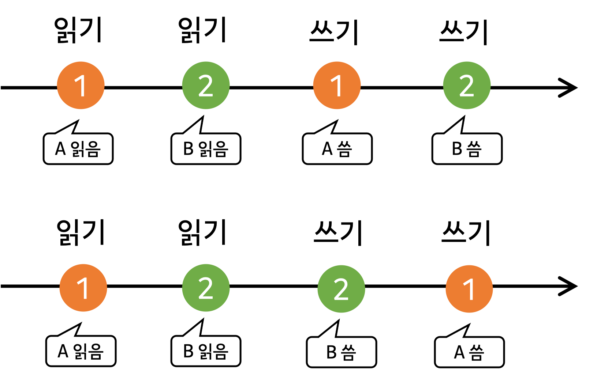
            
- 낙관적 동시성 제어는 일반적으로 검증이 성공적이고 트랜잭션을 재시도할 필요가 없는 경우 효율적이다
- 낙관적 동시성 제어에도 크리티컬 섹션이 있다
    - 크리티컬 섹션이란? 공유 자원에 대한 독점이 보장되는 임계 영역
    - 낙관적 동시성 제어에도 한 번에 한 개의 트랜잭션 만이 접근할 수 있는 크리티컬 섹션이 존재한다
    - 일부 작업에 비독점적 소유를 허용하는 또다른 방법
        - Reader-Writer Lock (Reader 간 자원 공유를 허용하는 잠금)
        - Upgradable Lock (필요 시 공유 잠금을 배타적 잠금으로 변환하는 잠금)

### 비관적 동시성 제어

- 비관적 동시성 제어는 ‘*충돌이 발생할 것이다*’고 가정한다 (~~절망회로를 돌린다~~)
- 비관적 동시성 제어는 트랜잭션 수행 중에 충돌 발생 가능성을 확인하고 계속 수행하거나 중단 또는 취소한다
- 비관적 동시성 제어 방식의 무잠금 방식 vs 잠금 방식
    - 무잠금 방식의 비관적 동시성 제어 방식
        - 각 트랜잭션에 **타임스탬프를 설정**하는 타임스탬프 순서화 알고리즘을 사용한다
        - 트랜잭션 **수행 여부는** 더 높은 타임스탬프가 설정된 트랜잭션이 커밋됐는지 여부에 따라 결정된다
        - 트랜잭션 매니저는 값 별로 읽기와 쓰기를 수행한 동시 수행 트랜잭션의 정보를 `max_read_timestamp`와 `max_write_timestamp`에 저장한다
        - `max_write_timestamp`보다 낮은 타임스탬프가 설정된 트랜잭션이 읽기 작업을 요청할 경우, 해당 작업을 허용하지 않는다 (이미 새로운 버전의 값이 존재하기 때문에)
        - 또한, `max_read_timestamp` 보다 낮은 타임스탬프가 설정된 트랜잭션의 쓰기 작업은 최근에 실행된 읽기 작업과 충돌하지만, 토마스 기록 규칙에 의해 허용한다
            - 토마스 기록 규칙
                - 트랜잭션이 쓰기를 수행하려 할 때,
                    - 해당 트랜잭션의 시간 < 해당 데이터를 마지막으로 읽은 시간 → 쓰기를 허용하지 않는다
                    - 해당 트랜잭션의 시간 < 해당 데이터를 마지막으로 쓴 시간 → 무시한다 (실행한 것으로 간주한다)
                    - 이외의 경우는 쓰기를 허용하고 해당 트랜잭션의 시간을 해당 데이터의 마지막으로 쓴 시간으로 업데이트한다
        - 실패한 트랜잭션은 동일한 타임스탬프를 사용하면 또다시 실패하기 때문에, 새로운 타임스탬프로 다시 수행한다
- 다중버전 동시성 제어
- 여러 버전의 레코드를 저장하고 단조 증가하는 트랜잭션 id 또는 타임스탬프로 식별하여 데이터베이스 트랜잭션의 일관성을 보장하는 동시성 제어 방식
- 커밋된 값과 커밋되지 않은 값
    - 다중버전 동시성 제어는 커밋된 값과 커밋되지 않은 값을 구분한다
    - 트랜잭션 매니저는 한번에 최대 하나의 커밋되지 않은 값이 존재하도록 제어한다
- 읽기 작업이 커밋되지 않은 값을 참조할 수 있는지에 대한 여부는 격리 수준에 따라 바뀐다
    - MVCC로 구현된 대표적 격리 수준 : 스냅숏 격리
- MVCC는 여러 가지 알고리즘을 사용해서 구현할 수 있다
    - 충돌 해결 알고리즘(잠금, 스케줄링, 2단계 잠금)을 사용해서 구현할 수도 있고 타임스탬프 순서화 알고리즘을 통해서도 구현할 수 있다

### 잠금 기반 동시성 제어

- 잠금 기반 동시성 제어는 데이터베이스 객체에 명시적으로 잠금을 설정하는 비관적 동시성 제어의 한 종류다
- 2 Phase Locking
    - 가장 보편적인 잠금 기법이다
    - ‘growing phase’와 ‘shrinking phase’가 있다
        - growing phase : 필요한 잠금을 획득하고 유지한다
        - shrinking phase : 획득한 잠금을 해제한다
    - **2 Phase Locking은 그 어떤 단계에서도 트랜잭션 수행을 제한하지 않는다**
    - 트랜잭션은 단 하나의 잠금이라도 해제하면 더이상 다른 잠금을 획득할 수 없다
- 보수적 2 Phase Locking
    - 변형된 2 Phase Locking
    - 트랜잭션 수행을 제한한다
- 교착 상태
    - 트랜잭션은 데이터베이스 객체에 대한 잠금을 요청한다
    - 잠금을 바로 획득하지 못할 경우, 다른 트랜잭션이 잠금을 해제할 때까지 기다려야 한다
    - 서로 사용중인 잠금을 해제하기를 기다리는 상태를 교착상태라고 한다
- 교착 상태의 해결방법
    - 가장 간단한 방법 : 타임아웃을 설정하기
        - 오랜동안 끝나지 않는 트랜잭션을 중단시킨다 (교착상태가 발생한 것으로 간주하는 것이다)
    - 보수적 2 Phase Locking의 경우에는 시작 전에 모든 잠금을 획득하지 못하면 트랜잭션이 중단된다
        - → 하지만 이 방식은 시스템의 동시성을 크게 저하시킨다
    - 따라서 대부분의 데이터베이스는 트랜잭션 매니저를 통해 교착 상태를 감지하고 예방한다
- 교착상태의 감지
    - 일반적으로 동시 수행중인 트랜잭션 간의 대기 상태를 그래프로 표현하는 대기 그래프를 사용해 감지한다
    - 교착 상태 감지는 일정 주기마다 또는 그래프가 업데이트될때마다 수행한다
        - (일반적으로 더 늦게 잠금을 요청한 트랜잭션이 중단된다)
    - 트랜잭션 매니저는 트랜잭션의 타임스탬프를 기반으로 우선순위를 지정한다
        - **타임스탬프가 낮을수록 우선순위가 높다** (~~늙은 놈이 쎄다~~)
- 교착 상태를 방지하는 방법
    - 다른 트랜잭션이 소유한 잠금을 요청하려 한다, 어떻게 교착 상태를 방지할 수 있을까?
        - wait-die
            - 기다리거나 죽는다
            - 자신보다 타임스탬프가 더 **높은** 트랜잭션만이 트랜잭션을 블록할 수 있다
                - 난 T**n**! T**k**보다 먼저 태어났지! → T**k**가 잠금을 획득했네.. → 기다려야지..
                - 난 T**n**! T**k**보다 이후에 태어났지! → T**k**가 잠금을 획득했네.. → 죽을래 → …(x초 후)… → T**n**은 같은 타임스탬프로 재시작
        - wound-wait
            - 상처를 입히거나 기다린다
            - 자신보다 타임스탬프가 더 **낮은** 트랜잭션만이 트랜잭션을 블록할 수 있다
                - 난 T**n**! T**k**보다 먼저 태어났지! → T**k**가 잠금을 획득했네.. → T**k** 죽여 → …(x초 후)… → T**k**는 같은 타임스탬프로 재시작
                - 난 T**n**! T**k**보다 이후에 태어났지! → T**k**가 잠금을 획득했네.. → 기다려야지
- 잠금 vs 래치
    - 같은 데이터 세그먼트를 수정하는 두 개의 트랜잭션을 동시에 수행할 때 논리적 일관성을 보장하기 위해서는 서로의 중간 결과를 볼 수 없어야 한다
    - 트랜잭션 처리에서 논리적 무결성과 물리적 무결성은 각각 잠금과 래치를 사용해 유지한다
    - 잠금
        - 동시 수행 트랜잭션을 격리 및 스케줄링하고 데이터베이스 상태를 관리하는데 사용된다
        - 내부 스토리지 구조와는 무관하며, 특정 키 또는 특정 범위의 키를 보호한다
        - 데이터베이스 잠금 매니저가 관리하는 상위 레벨의 개념이다
    - 래치
        - 물리적 구조를 보호한다
        - 래치는 물리적 트리 구조를 보호하며 페이지에 대해 요청할 수 있다
        - 특정 페이지에 동시에 접근하기 위해서는 반드시 래치를 획득해야 한다
            - (무잠금 동시성 제어 방식도 래치를 사용한다)
        - 리프 노드를 수정하면 B-트리의 상위 레벨도 변경될 수 있다 → 여러 레벨에 대한 래치가 필요하다
        - 소스 노드와 대상 노드 모두에 데이터가 존재하거나 데이터가 아직 상위 노드로 전파되지 않은 불완전한 쓰기 또는 노드 분할은 수행중인 트랜잭션에서 볼 수 없도록 해서, 상태의 일관성을 유지해야 한다
        - 동시 수행 작업
            - 동시 읽기 : 여러 스레드가 같은 페이지를 요청한다 (단, 수정하지 않는다)
            - 동시 업데이트 : 여러 스레드가 같은 페이지를 수정한다
            - 쓰기 중 읽기 : 스레드가 페이지를 수정하는 동안, 다른 페이지가 같은 페이지를 읽는다
        - 동시성을 높이기 위해서는 래치를 페이지를 읽거나 업데이트 하는 동안에만 가능한 최대한 짧게 유지해야 한다
- 래치 구현 방법
    - 가장 간단한 래치 구현 방식 : 요청하는 스레드에 배타적 읽기/쓰기를 허용한다
        - 하지만 대부분의 경우 모든 프로세스를 서로 분리할 필요는 없다
        - 같은 페이지에 동시에 접근해도 아무런 문제가 발생하지 않는다
        - 여러 Writer가 동시에 겹치지 않고 Reader와 Writer가 겹치지 않도록 하면 된다
    - 가장 간단한 래치 획득 방식 : 루트에서부터 대상 리프 노드 사이의 모든 래치를 획득한다
        - 동시성 병목현상이 발생할 수 있지만, 비교적 쉽게 방지할 수 있다
            - 래치를 소유하는 시간은 최소화하며 Latch Crabbing 기법을 사용하여 문제를 해결한다
    - Reader-Writer Lock (RW Lock)
        - 여러 리더가 동시에 같은 객체를 읽는 것을 허용한다
        - 반면, Writer는 객체를 독점해야 한다
        - 오직 Reader만이 Shared Lock을 소유할 수 있다
        - Reader와 Writer 조합은 배타적 잠금을 요청해야 한다
            
            
            
            - 여러 Reader가 같은 객체를 참조중일 때 Writer는 해당 페이지를 수정할 수 없기 때문에 기다려야 한다
                
                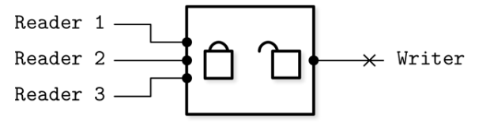
                
            - Writer 1이 객체에 대한 배타적 잠금을 소유하고 있을 경우, 다른 Reader와 Writer는 모두 기다려야 한다
                
                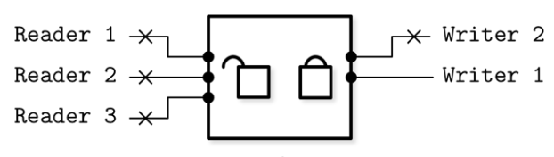
                
    - Latch Crabbing
        - 래치를 최대한 짧게 소유하고 작업을 수행하는 방법
        - 래치가 더이상 필요하지 않을 경우 바로 해제한다
        - 노드 삽입으로 인해 노드를 포함한 트리의 구조가 변경되지 않을 것이 확실하다면, 부모 레벨의 래치는 바로 해제한다
            - 즉, 자식 노드가 가득 찬 상태가 아니라면 부모 레벨의 래치는 해제한다
            - 1. 루트 레벨에 대한 쓰기 래치를 획득한다
                
                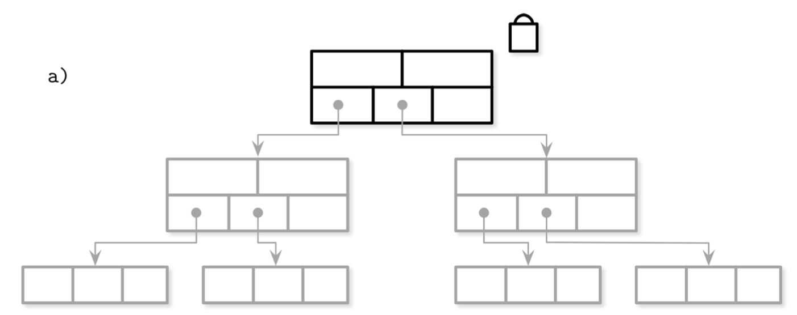
                
            - 2. 다음 레벨의 노드를 찾고 해당 노드에 대한 쓰기 래치를 획득한다
            - 3. 해당 노드가 구조 변경을 일으킬 수 있는지 확인한다
            - 4. 노드가 가득찬 상태가 아니라면 부모 레벨의 래치는 해제한다
                
                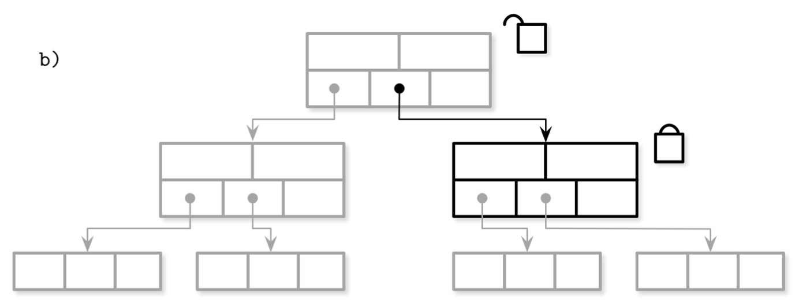
                
            - 5. 다음 레벨의 쓰기 래치를 획득한다
            - 6. 리프 노드가 구조 변경을 유발할 수 있는지 확인한다
            - 7. 부모 레벨의 래치를 해제한다
                
                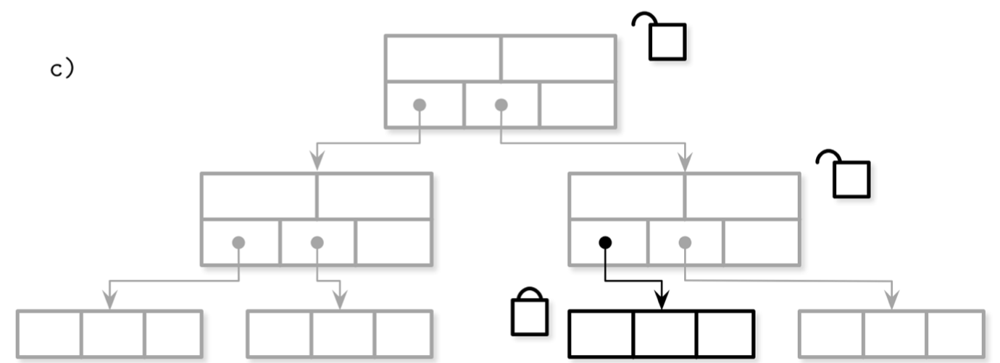
                
            - 8. :
        - 삭제도 자식 노드에 충분한 수의 요소가 있고 형제 노드와의 병합도 발생하지 않는다면, 부모 레벨의 래치는 바로 해제한다
        - 낙관적인 Latch Crabbing
            - 대부분의 삽입과 삭제 작업은 상위 레벨로 전파되는 구조 변경을 발생시키지 않는다고 가정한다 (낙관적)
            - 실제로 구조 변경이 발생할 확률은 높은 레벨로 올라갈수록 줄어든다
            - 대부분의 작업은 대상 노드의 래치만을 필요로 하고 부모 레벨의 래치를 유지해야 하는 경우는 드물다

### Reference

- 페이지 교체 알고리즘 [https://dhkdn9192.github.io/computer_science/page-replacement-algorithm/](https://dhkdn9192.github.io/computer_science/page-replacement-algorithm/)
- wait-die vs wound-wait : [https://stackoverflow.com/questions/32794142/what-is-the-difference-between-wait-die-and-wound-wait-deadlock-prevention-a](https://stackoverflow.com/questions/32794142/what-is-the-difference-between-wait-die-and-wound-wait-deadlock-prevention-a)