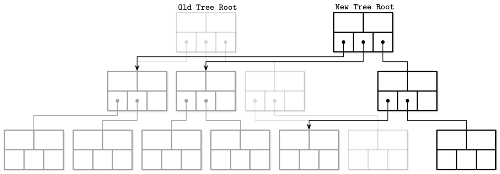

# Chapter 6. B-트리의 변형

## 1. 쓰기 시 복사 (Copy-on-Write)

---

- 쓰기 시 복사 방식: 동시 수행 작업의 데이터 무결성을 보장하기 위해 복잡한 래치 메커니즘 대신
    - 페이지를 수정하기 전에 내용을 복사해 원본 대신 복사본을 수정한다 → 평행 트리 계층 구조가 생성된다.
        
        
        
        6-1. 쓰기 시 복사형 B-트리
        
    - 라이터와 동시 수행 중인 리더는 과거 버전의 트리를 읽을 수 있으나,
    - 라이터가 작업중인 수정된 페이지에 접근해야 하는 라이터는 먼저 수행 중인 쓰기 작업이 모두 완료될 때까지 대기해야 한다.
    - 새로운 페이지 계층이 생성되면 최상단 페이지를 가리키는 포인터를 업데이트 한다.
- 단점
    - 더 많은 메모리가 필요하다.
    - 페이지 전체를 복사하기 때문에 프로세서 사용량도 증가한다.
- 장점
    - B-트리는 일반적으로 높이가 낮기 때문에
        - 쓰기 시 복사 방식의 단순함과 장점은 단점을 능가한다.
    - 한번 쓴 페이지는 수정할 수 없고 접근하는 데 래치가 필요 없기 때문에 리더를 위해 동기화하지 않아도 된다.
    - 어떤 작업도 불완전한 상태의 페이지에 접근할 수 없고 시스템 장애는 손상된 페이지를 남기지 않는다.

### 1-1. 쓰기 시 복사 방식 구현: LMDB

---

- LMDB(Lightning Memory-Mapped Database): OpenLDAP 프로젝트에서 사용하는 키-값 데이터베이스
    - 구조와 설계상 페이지 캐시와 선행 기록 로그, 체크포인트, 컴팩션을 사용하지 않는다.
    - 단일 레벨 구조의 데이터베이스
        - 읽기와 쓰기 작업이 메모리 맵에 바로 접근한다.
        - 업데이트 시 루트에서 리프 노드까지의 경로의 모든 노드를 복사한다.
    - 두 개의 버전의 루트 노드가 있다 → 최신 버전, 변경 사항이 커밋될 버전
        - 새로운 루트 노드가 생성되면 이전 루트 노드는 더 이상 읽기와 쓰기에 사용될 수 없다.
        - 형제 노드 포인터가 없기 때문에 순차적 접근 시 부모 노드를 재방문해야 한다.
    - MVCC 와 현재 실행 중인 읽기 트랜잭션이 참조할 수 있는 복사본이 존재한다 → 과거 데이터를 복사된 노드에 저장하는 것은 비효율적이다.
        - 리더는 라이터와 어떤 방식으로도 겹치지 않기 때문에 잠금이 필요없다.

## 2. 노드 업데이트 추상화

---

- 디스크에 저장된 페이지를 업데이트하기 전에 우선 메모리에 저장된 상태부터 업데이트해야 한다.
- 메모리에 저장된 노드에 접근하는 여러 방법
    - 캐시된 버전(의 노드)에 바로 접근하는 방법
        - 메모리 모델이 없는 언어(languages with an unmanaged memory model)는 B-트리 노드에 저장된 원시(raw) 이진 데이터를 해석하고 네이티브 포인터를 사용해 제어할 수 있다.
        - 노드 → 포인터와 런타임 형변환을 통해 원시 이진 데이터를 제어하는 자료 구조
            - 대부분 페이지 캐시가 관리하는 메모리 영역을 가리키거나 메모리 매핑을 사용한다.
    - 기반 언어로 인메모리 객체 생성하는 방법
        - B-트리 노드를 객체 또는 기반 언어 고유의 자료구조로 구체화하는 방법
        - 삽입 및 업데이트, 삭제 시 사용할 수 있다. 나아가 플러시 작업은 변경 사항을 메모리에 저장된 페이지에 반영한 뒤에 디스크로 플러시한다.
        - 원시 페이지 수정은 중간 객체에 대한 접근과 별개로 수행되기 때문에 동시 접근이 쉽다.
        - 하지만 메모리에 두 개의 버전(로우 이진 데이터와 언어 고유 자료 구조)의 페이지를 저장하기 때문에 메모리 오버헤드가 발생한다.
    - 래퍼 객체를 사용하는 방법
        - 변경 사항을 즉시 B-트리에 구체화하는 래퍼 객체를 통해 노드가 복사된 버퍼에서 읽는 것
        - 주로 메모리 모델을 지원하는 언어(languages with a managed memory model)에서 사용하는 방식
        - 래퍼 객체는 버퍼에 변경 사항을 반영한다.

<aside>
💡 디스크에 저장된 페이지와 캐시된 버전, 인메모리 버전을 모두 따로 관리하면 각각 다른 라이프 사이클을 가질 수 있다.

</aside>

## 3. 지연형 B-트리

---

- 더 가볍고 동시성 지원 및 업데이트가 쉬운 인메모리 자료 구조를 사용해 변경 사항을 버퍼하고 동기화를 지연해 업데이트 비용을 낮춘다.

### 3-1. 와이어드타이거

---

- B-트리 노드는 페이징 즉시 메모리에 구체화되고 플러시되기 전까지 업데이트 내용을 메모리에 유지한다.
- MongoDB 의 기본 스토리지 엔진 와이어드타이거가 유사한 방식을 사용한다.

- 로우 스토어(row store) B-트리를 인메모리와 디스크의 페이지에 각각 다른 형식으로 저장한다.
- 인메모리 페이지는 영구 저장되기 전에 조정 과정을 거친다.
    
    
    
    6-2. 와이어드타이거: 기본 구조
    
    - 클린(clean) 페이지는 디스크 페이지 이미지에서 생성된 인덱스만으로 구성된다. 변경사항은 먼저 업데이트 버퍼에 저장한다.
    - 업데이트 버퍼는 읽기 작업 시 접근된다. 버퍼된 내용과 원본 디스크 페이지를 합쳐서 가장 최신 데이터를 반환한다.
    - 페이지를 플러시하면 업데이트 버퍼의 내용과 페이지 내용을 합치고 디스크에 저장된 기존 페이지를 덮어쓴다.

- 와이어드타이거의 클린 페이지와 더티 페이지
    
    
    
    6-3. 와이어드타이거 페이지
    
    - 인메모리 버전과 디스크 페이지 이미지에 대한 레퍼런스가 저장됨
    - 더티 페이지에는 업데이트 버퍼를 추가로 저장한다.

- 장점: 페이지 업데이트와 구조 변경(분할 및 병합)은 백그라운드 스레드가 처리하기 때문에 읽기와 쓰기 작업은 다른 스레드가 완료될 때까지 기다릴 필요가 없다.

### 3-2. 지연 적응형 트리

---

- 노드를 서브트리 단위로 그룹화하고 각 서브트리별로 배치 작업을 저장하는 업데이트 버퍼를 사용
    
    
    
    6-4. LA(Lazy-Adaptive)-트리
    
    - 새로운 데이터 레코드를 삽입할 때 값을 우선 루트 노드의 업데이트 버퍼에 저장한다.
    - 버퍼가 가득차면 변경 사항을 하위 레벨의 버퍼로 복사 및 이동해 공간을 확보한다.(재귀적으로 반복)
    - 버퍼는 계층 종속적이며 계단식으로 전달된다. 업데이트가 리프 레벨에 도달하면 삽입과 업데이트, 삭제 작업을 배치 단위로 수행하게 되며, 모든 내용 수정 및 구조 변경 작업을 한 번에 반영한다.
    
    👉 디스크 요청 횟수가 줄어들고 상위 레벨로 전파되는 분할 및 병합 작업도 배치 단위로 적용하기 때문에 구조 변경 횟수도 줄어든다.
    

## 4. FD-트리

---

- B-트리 유지관리 작업에서는 리프 노드 수정과 부모 레벨로 전파되는 분할 및 병합 등의 과정에서 많은 랜덤 쓰기가 발생한다.
    - HDD에서는 헤드 위치를 이동하는 과정 때문에 랜덤 쓰기가 매우 느리다.
- FD-트리: 작은 가변 헤드 트리(head tree)와 여러 개의 정렬된 불변 배열로 구성
    - 랜덤 쓰기를 하는 위치가 변경 사항을 버퍼하는 작은 B-트리(헤드 트리)로 줄어든다.
    - 헤드 트리가 가득 차면 저장된 내용을 불변 배열로 옮긴다. 새로운 배열의 크기가 일정량보다 크면 다음 레벨의 배열과 합친다.
    - 데이터 레코드는 상위 레벨에서 하위 레벨로 복사된다.

### 4-1. 부분적 캐스케이딩

---

- 부분적 케스케이딩(fractional cascading)을 사용해 레벨 간 포인터를 유지한다.
    - 정렬된 배열에서 특정 아이템을 찾는 비용을 줄일 수 있다.
    - 갭(상위 레벨에서 참조하는 포인터가 없는 그룹)을 최소화하기 위해 인근 레벨의 배열을 브리지(bridge)를 통해 연결하고 레벨 사이에 지름길을 만든다.
        - 브리지: 상위 레벨에 존재하지 않는 요소를 하위 레벨에서 끌어올리고 하위 레벨에서의 위치를 가리키는 포인터
- ex> 3개의 정렬된 배열
    
    
    
    - 인덱스가 높은 배열에서 낮은 배열로 한 요소씩 걸러 끌어올리면 검색을 단순화할 수 있다.
        
        
        
    - 끌어올린 요소와 하위 레벨에서의 위치를 잇는 브리지(FD-트리에서는 펜스)를 만들 수 있다.
        
        
        
        6-5. 부분적 캐스케이딩 → 25 연결 잘못되어 있음
        
        → 이 포인터를 사용해 상위 레벨에서 검색 대상 키에 더 가까운 값을 찾을 수 있기 때문에 하위 레벨 탐색 비용이 줄어든다.
        
    
    👉 여러 정렬된 리스트를 연결해 탐색 비용을 줄일 수 있다.
    

### 4-2. 로그 배열 (Logarithmic Runs)

---

- FD-트리는 부분적 캐스케이딩과 크기가 로그 단위로 증가하는 배열을 결합해 사용한다.
    - 이전 레벨의 배열과 현재 배열을 합친 정렬된 불변 배열
    - 크기가 k 의 배수로 증가한다.

6-6. FD-트리 구조

- FD-트리는 페이지를 인플레이스 업데이트하지 않기 때문에 같은 키가 여러 레벨에 존재할 수 있다.
- 삭제된 키에는 삭제됐음을 나타내는 툼스톤을 삽입한다.
    - 하위 레벨에 존재하는 같은 키의 레코드도 모두 삭제돼야 한다.
    - 툼스톤이 최하위 레벨까지 전파되면 더 이상 남은 값이 없기 때문에 모두 삭제해도 된다.

## 5. Bw-트리

---

- 문제 1. 쓰기 증폭(write amplification)
    - B-트리의 인플레이스 업데이트 구현에서 가장 중요한 문제다.
    - 연속된 B-트리 페이지 수정으로 인해 디스크에 저장된 페이지 원본을 모든 요청마다 업데이트하는 상황이 발생할 수 있기 때문
- 문제 2. 메모리 증폭(space amplification)
    - 업데이트를 위한 공간을 미리 확보할 때 발생
    - 요청된 데이터를 담고 있는 유용한 바이트를 전송하려면 매번 빈 바이트와 해당 페이지의 나머지 부분을 같이 전송해야 한다는 의미
- 문제 3. 해결하기 어려운 동시성 문제와 래치 사용의 복잡성

👉

- Buzzword-트리: 한 번의 CAS 연산으로 노드 사이를 연결하는 포인터를 생성할 수 있는 인메모리 자료 구조를 사용 → 잠금이 필요 없는 트리

### 5-1. 체인 업데이트

---

- Bw-트리는 변경 사항과 원본 노드(base node)를 따로 저장한다.
- 변경 사항(델타 노드)은 체인을 형성한다.
    - 가장 최신 수정본부터 순서대로 정렬하고 원본 노드를 가장 마지막에 저장한 링크드 리스트 형태의 체인
    - 델타 노드는 삽입과 업데이트(삽입과 구별 불가능), 삭제 작업을 모두 포함한다.
    - 읽기 작업 시 모든 델타 노드를 순회해 원본 노드를 최신 상태로 동기화해야 한다.
        - 변경 사항을 메인 자료 구조와 별도로 저장하고 읽기 시 반영하는 LA-트리(지연 적응형 트리)와 유사하다.

### 5-2. CAS 연산으로 동시성 문제 해결

---

- Bw-트리는 원본과 델타 노드 외에 논리적 식별자와 디스크에서의 위치를 매핑하는 인메모리 매핑 테이블을 저장한다.
    - 매핑 테이블을 사용하면 쓰기 작업 시 배타적 잠금을 획득하는 대신 매핑 테이블의 물리적 오프셋을 CAS(compare-and-swap) 연산으로 변경할 수 있기 때문에 래치가 필요 없다.
    
    
    
    6-7. Bw-트리. 점선은 매핑 테이블에 저장된 노드 사이의 가상 링크를 나타낸다. 실선은 노드 사이의 포인터를 나타낸다.
    
    - 논리적 노드는 한 개의 원본 노드와 여러 델타 노드로 구성된다.
- Bw-트리의 노드 업데이트 알고리즘
    1. 루트 노드에서 리프 노드까지 순회하면서 대상 논리적 리프 노드를 찾는다. 매핑 테이블에는 원본 노드 또는 업데이트 체인에서 가장 최신 델타 노드를 가리키는 가상 링크를 저장한다.
    2. 1단계에서 찾은 원본 노드(또는 최신 델타 노드)를 가리키는 새로운 델타 노드를 생성한다.
    3. 2단계에서 생성한 델타 노드를 가리키는 포인터를 매핑 테이블에 업데이트 한다 → CAS 사용

- CAS: 원자적인 연산
    - 포인터 업데이트와 동시에 요청된 모든 읽기 작업은
        
        → 리더와 라이터를 블록하지 않고 업데이트 작업 전 또는 후에 실행한다.
        
    - 업데이트 작업 전에 실행되는 읽기 작업은
        - 기존 포인터를 참조하기 때문에 아직 추가되지 않은 새로운 델타 노드에 대해서 알 수 없다.
    - 업데이트 작업 후에 실행되는 읽기 작업은
        - 새로운 포인터를 참조해 최신 상태를 볼 수 있다.
    
    👉 동시에 같은 논리적 노드에 새로운 델타 노드를 추가하려고 하면 둘 중 하나만 성공할 수 있고 다른 스레드는 작업을 재시도해야 한다.
    

### 5-3. 구조 변경 작업

---

- 노드는 너무 크거나(오버플로우 발생) 거의 비어 있는(언더플로우 발생) 상태일 수 없으며 분할 및 병합 등의 구조 변경 작업이 필요하다. B-트리와 유사하지만 구현 방식은 다를 수 있다.
- 분할 SMO: 분할 대상 노드의 원본 노드에 델타를 반영해 논리적 상태를 최신 상태로 업데이트하고 분할 지점의 오른쪽에 새로운 페이지를 추가한다. 이후의 단계는
    1. 분할
        - 리더가 분할이 진행 중이라는 사실을 알 수 있도록 특수한 분할 델타 노드를 분할 노드의 끝에 추가한다.
        - 분할 델타 노드는 분할 노드의 레코드를 무효화하기 위한 중간 지점의 구분 키와 새로운 형제 노드를 가리키는 링크로 구성된다.
    2. 부모 노드 업데이트
        - 이 시점의 상태는 B-link-트리의 중간 분할 상태와 유사하다.
        - 새로운 노드는 분할 델타 노드 포인터를 통해 접근할 수 있지만 아직 참조하는 부모 노드가 없다 → 리더는 분할 노드의 형제 포인터를 통해 접근할 수밖에 없다.
        - 리더가 분할 노드를 통하지 않고 바로 새로운 노드에 접근할 수 있도록 노드를 가리키는 포인터를 부모 노드에 추가하면 분할 작업이 완료된다.
- 병합 SMO
    1. 형제 노드 제거
        - 병합 SMO 의 시작과 삭제 대상 노드를 의미하는 특수 삭제 델타 노드를 오른쪽 형제 노드에 추가한다.
    2. 병합
        - 왼쪽 형제 노드에 오른쪽 형제 노드를 가리키는 병합 델타 노드를 추가해 오른쪽 형제 노드를 왼쪽 형제 노드의 논리적 노드로 만든다.
    3. 부모 노드 업데이트
        - 왼쪽 형제 노드에서 오른쪽 형제 노드의 요소에 접근할 수 있다. 부모 노드에서 오른쪽 자식 노드를 가리키는 포인터를 삭제하면 병합 작업이 완료된다.

- SMO 가 동시에 같은 노드를 분할 또는 병합하는 것을 방지하고자 부모 노드에 중지 델타 노드를 추가해야 한다.
    - 중지 델타 노드는 쓰기 잠금과 비슷하다.
    - 동시에 한 개의 스레드만이 노드에 대한 쓰기 권한을 가질 수 있고 해당 델타 노드에 새로운 노드를 추가하는 모든 다른 스레드는 중단된다.

### 5-4. 노드 통합과 가비지 컬렉션

---

- 아무 조치를 취하지 않으면 델타 체인은 매우 길어질 수 있다 → 읽기 작업 비용이 증가하기 때문에 길이를 적당하게 유지해야 한다.
    - 설정해 둔 상한에 도달하면 원본 노드와 델타 노드를 합쳐서 새로운 원본 노드로 통합한다.
    - 통합된 노드는 디스크의 새로운 위치에 저장하고 매핑 테이블의 노드 포인터가 새로운 노드를 가리키도록 업데이트한다.
        - 기존 내용(원본 노드와 모든 델타 노드)은 더 이상 매핑 테이블을 통해 접근할 수 없다.
        - 하지만 다른 진행 중인 작업에서 해당 부분을 참조하고 있을 수 있기 때문에 바로 메모리를 해제하지 않는다.
        - 특정 노드에 대한 접근이 허용되는 스레드와 허용되지 않는 스레드를 구분하기 위해 Bw-트리는 에포크 기반의 교정기법을 사용한다. 이후에 시작한 리더는 해당 노드에 절대 접근할 수 없기 때문에 작업이 완료되면 안전하게 가비지 컬렉션을 통해 정리한다.
- Bw-트리는
    - 흥미로운 B-트리의 변형이다.
    - 쓰기 증폭 문제를 해결하고 논블로킹 액세스와 캐시 친화적이다.

## 6. 캐시 비인지형 B-트리

---

- 메모리 계층 구조와 파라미터 조정 여부와 상관없이 점근적으로 최적의 성능을 보장한다 → 캐시 라인과 파일시스템 블록, 디스크 페이지의 크기와 무관하다는 의미

- B-트리의 노드들은 디스크 페이지에 저장되며, 페이지 캐시를 통해 메인 메모리에서 효율적으로 액세스된다.
    - 2-레벨 계층 구조: 페이지 캐시, 디스크
        - 디스크는 여러 블록으로 나뉘고 데이터는 디스크와 캐시 사이에 블록 단위로 전송한다.
    - 캐시 인지형 방식: 블록 안의 한 개의 레코드만을 요청해도 블록 전체를 읽어야 한다.

- 캐시 비인지형 알고리즘: 멀티 레벨 계층 구조의 이점을 제공하면서 자료 구조를 2-레벨 메모리 계층 구조의 관점에서 바라볼 수 있다.
    - 플랫폼에 종속적인 파라미터가 필요 없고 레벨 사이의 전송 횟수를 상수 범위 내로 보장한다.

### 6-1. 반 엠데 보아스 레이아웃

---

- 캐시 비인지형 B-트리 구성
    
    
    
    6-8. vEB 레이아웃
    
    - 논리적으로 그룹화된 노드는 서로 모여 있다.
    - 상단은 논리적 레이아웃(노드가 트리를 형성하는 방식)을 나타내고 하단은 노드가 메모리와 디스크에 저장되는 방식을 나타낸다.
    - 정적 B-트리
        - 반 엠데 보아스(vEB) 레이아웃을 기반으로 생성한다.
        - 트리의 에지를 잘라 분할하고 재귀적으로 각 서브트리를 분할하면 sqr(N) 크기의 여러 서브트리가 생긴다.
        - 모든 재귀적 트리는 연속된 메모리 블록에 저장된다.
    - 패킹된(묶음형) 배열
        - 자료 구조를 동적으로 제어하기 위해(ex> 삽입과 업데이트, 삭제 허용) 사용
        - 연속된 메모리 세그먼트를 이용해 원소들을 저장하지만, 나중에 삽입될 원소들을 위한 갭을 마련해둔다.
            - 갭의 간격은 밀도 기준 값에 따라 설정한다.
            
            
            
            6-9. 패킹된 배열
            
            - 더 적은 재배치 횟수로 트리에 요소를 삽입할 수 있다.
                - 새로운 요소가 들어갈 갭이 없을 경우 다른 요소를 재배치해야 한다.
            - 패킹된 배열의 밀집도가 너무 높거나 너무 낮은 경우 크기를 줄이거나 확장하기 위해 배열을 재구성해야 한다.
    - 정적 트리는 최하위 레벨의 패킹된 배열의 인덱스로 사용한다. 재배치된 요소가 최하위 레벨의 해당 요소를 가리키도록 업데이트해야 한다.

- 사용 사례가 없는 유력한 이유
    1. 캐시 로딩 단계를 추상화해도 데이터를 블록 단위로 읽고 쓰는 구조에서 페이징하고 만료하는 방식이 여전히 결과에 안 좋은 영향을 주기 때문
    2. 블록 전송 관점에서 캐시 비인지형 B-트리와 캐시 인지형 B-트리의 복잡도가 같다.